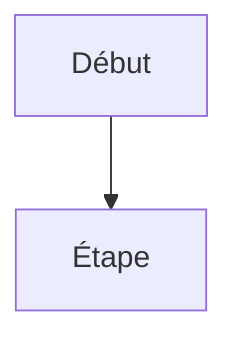

# Documentation IA — Instructions Workspace

## Contexte du projet

Ce projet est une **documentation technique en français** sur GitHub Copilot, construite avec **MkDocs Material**. Elle couvre la configuration et l'utilisation de Copilot pour deux IDEs : IntelliJ IDEA et Visual Studio Code.

**Audience cible** : développeurs francophones, tous niveaux (débutant → expert).

## Structure du projet

```
docs/
├── index.md                          ← Page d'accueil
├── chapitre-1-installation/          ← Installation par IDE
├── chapitre-2-parametrage/           ← Paramètres Copilot
├── chapitre-3-contexte/              ← Personnalisation et contexte
├── chapitre-4-bonnes-pratiques/      ← Best practices
├── chapitre-5-troubleshooting/       ← Résolution de problèmes
├── chapitre-6-cas-usage/             ← Use cases (Java, Python, Node.js)
├── appendices/                       ← FAQ, raccourcis, ressources
├── assets/images/                    ← Captures d'écran (intellij/ et vscode/)
└── stylesheets/extra.css             ← Styles personnalisés
mkdocs.yml                            ← Configuration (nav, thème, extensions)
```

## Commandes essentielles (Windows)

```powershell
# Serveur de développement local
py -m mkdocs serve

# Build statique
py -m mkdocs build

# Vérifier la version
py -m mkdocs --version
```

Toujours utiliser `py -m` (pas `mkdocs` directement) car les scripts Python ne sont pas dans le PATH sur ce système Windows.

## Conventions de rédaction

- **Langue** : français exclusivement pour tout contenu documentaire
- **Ton** : pédagogique, concis, direct ; le tutoiement est acceptable
- **Titres** : chaque page commence par un `# H1` comme titre principal, suivi de `## H2` pour les sections — ne jamais sauter de niveau de titre
- **Nommage des fichiers** : `kebab-case.md` dans `chapitre-N-slug/`
- **Images** : captures dans `docs/assets/images/intellij/` ou `docs/assets/images/vscode/`

## Syntaxe MkDocs Material à utiliser

### Badges de niveau (en haut de chaque page pertinente)

```html
<span class="badge-beginner">Débutant</span>
<span class="badge-intermediate">Intermédiaire</span>
<span class="badge-expert">Expert</span>
<span class="badge-vscode">VS Code</span>
<span class="badge-intellij">IntelliJ</span>
```

### Admonitions

```markdown
!!! tip "Titre optionnel"
    Conseil pratique.

!!! info "Information"
    Note informative.

!!! warning "Attention"
    Point de vigilance.

!!! danger "Danger"
    Risque critique.

!!! example "Exemple"
    Exemple concret.
```

### Contenu à onglets (comparaisons IntelliJ / VS Code)

```markdown
=== "IntelliJ IDEA"
    Contenu IntelliJ...

=== "Visual Studio Code"
    Contenu VS Code...
```

### Blocs de code

Toujours spécifier le langage : ` ```powershell `, ` ```python `, ` ```java `, ` ```typescript `, ` ```yaml `, ` ```markdown `

### Diagrammes Mermaid

```markdown

```

## Règles obligatoires

1. **Mettre à jour `mkdocs.yml`** (section `nav:`) pour toute nouvelle page créée
2. **Pages de comparaison** : suivre le pattern `comparaison-*.md` avec tableaux `| Critère | IntelliJ | VS Code |`
3. **Pages `index.md`** : chaque chapitre a un index qui présente le sommaire du chapitre
4. **Validation** : après modification, vérifier que `py -m mkdocs build` ne produit pas d'erreurs
5. **Pas de contenu spécifique à un seul IDE** dans les pages de chapitre générales — utiliser des onglets ou des pages dédiées

## Ressources de référence internes

- `docs/chapitre-3-contexte/instructions.md` — Conventions d'instructions Copilot
- `docs/chapitre-3-contexte/agents.md` — Conventions d'agents Copilot
- `docs/chapitre-3-contexte/prompt-files.md` — Conventions de prompt files
- `docs/stylesheets/extra.css` — Classes CSS personnalisées disponibles
- `mkdocs.yml` — Structure de navigation existante (référence de pattern)
