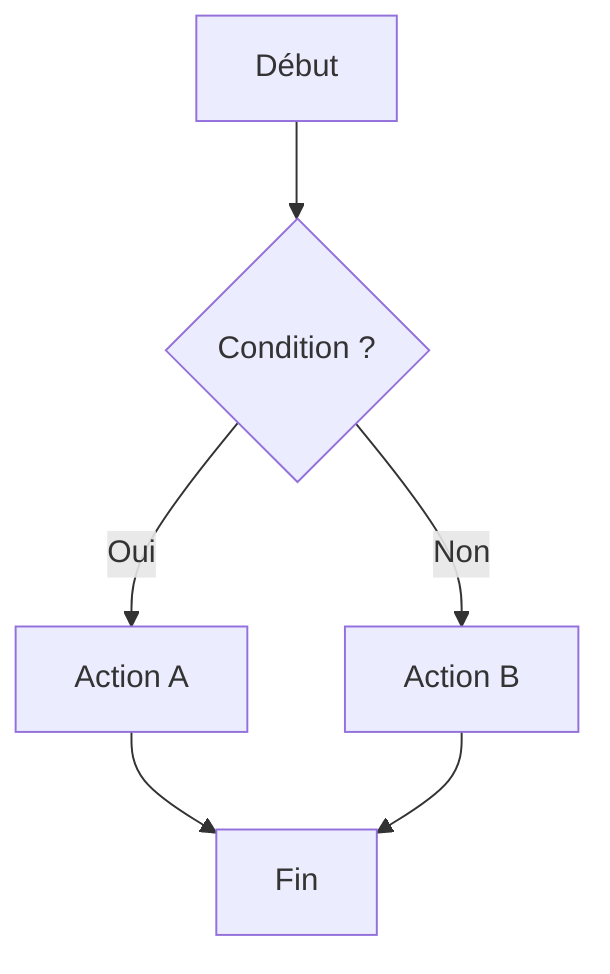
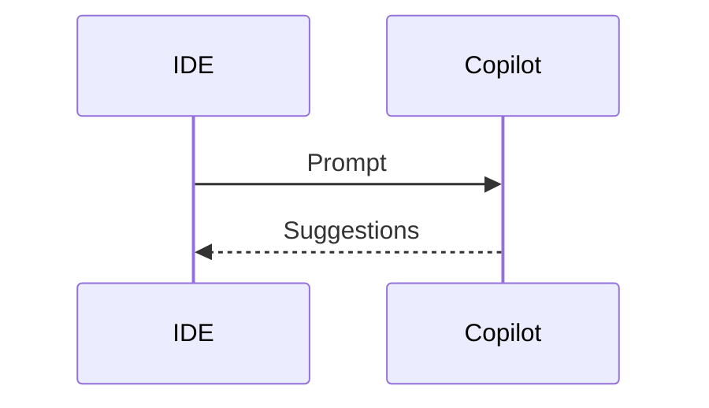

# Syntaxe MkDocs Material — Référence du Projet

## Extensions actives (mkdocs.yml)

```yaml
markdown_extensions:
  - admonition
  - pymdownx.details
  - pymdownx.superfences        # Mermaid + code blocks
  - pymdownx.tabbed             # Onglets === "Tab"
  - pymdownx.highlight          # Coloration syntaxique
  - pymdownx.inlinehilite       # Highlight inline
  - pymdownx.snippets           # Include de fichiers
  - pymdownx.keys               # ++ctrl+s++
  - pymdownx.emoji              # :material-*:
  - tables
  - attr_list                   # { .class } sur éléments
  - md_in_html                  # markdown dans <div markdown>
  - toc                         # Table des matières auto
```

## Admonitions — Référence complète

```markdown
!!! note
    Note générale.

!!! tip "Astuce"
    Conseil pratique actionnable.

!!! info "Information"
    Contexte informatif.

!!! warning "Attention"
    Point de vigilance important.

!!! danger "Danger"
    Risque sérieux, à ne pas ignorer.

!!! example "Exemple"
    Démonstration concrète.

!!! question "À retenir"
    Questions fréquentes ou récapitulatif.

!!! success "Bonne pratique"
    Ce qu'il faut faire.

!!! failure "Mauvaise pratique"
    Ce qu'il ne faut pas faire.

!!! abstract "Résumé"
    Synthèse d'une section.
```

### Sections repliables

```markdown
??? tip "Titre — cliquer pour déplier"
    Contenu masqué par défaut.

???+ info "Titre — déplié par défaut"
    Contenu visible au chargement.
```

## Onglets (Tabbed)

```markdown
=== "IntelliJ IDEA"
    Contenu IntelliJ ici.
    Indentation 4 espaces obligatoire.

    ```java
    // Code IntelliJ
    ```

=== "Visual Studio Code"
    Contenu VS Code ici.

    ```typescript
    // Code VS Code
    ```

=== "Les deux"
    Contenu commun.
```

> Labels standards : `"IntelliJ IDEA"` et `"Visual Studio Code"` (ne pas abréger)

## Blocs de code avec annotations

```python title="exemple.py" linenums="1" hl_lines="3"
def ma_fonction():
    # Cette ligne est mise en valeur
    return "résultat"  # (1)!
```
1. Annotation numérotée, apparaît comme tooltip.

Langages courants : `python`, `java`, `typescript`, `javascript`, `yaml`, `json`, `powershell`, `bash`, `markdown`, `html`, `css`

## Diagrammes Mermaid

```markdown

```

```markdown

```

## Raccourcis clavier

```markdown
++ctrl+shift+p++   → Palette de commandes
++tab++            → Accepter suggestion
++alt+backslash++  → Déclencher manuellement
++escape++         → Rejeter suggestion
```

## Icônes et emojis Material

```markdown
:material-github:              → GitHub
:material-lightning-bolt:      → Vitesse/Performance
:material-brain:               → IA/Intelligence
:material-shield-check:        → Sécurité
:material-code-tags:           → Code
:material-cog:                 → Paramètres
:material-rocket-launch:       → Démarrage rapide
:material-check-circle:        → Succès/Validé
:material-close-circle:        → Erreur/Non compatible
:material-information:         → Information
:fontawesome-brands-github:    → Logo GitHub
:fontawesome-brands-python:    → Logo Python
:fontawesome-brands-java:      → Logo Java
```

## Badges CSS personnalisés

```html
<!-- Niveau de difficulté -->
<span class="badge-beginner">Débutant</span>
<span class="badge-intermediate">Intermédiaire</span>
<span class="badge-expert">Expert</span>

<!-- IDE concerné -->
<span class="badge-vscode">VS Code</span>
<span class="badge-intellij">IntelliJ</span>
```

## Tableaux formatés

```markdown
| Critère | IntelliJ IDEA | Visual Studio Code |
|---------|:-------------:|:-----------------:|
| **Fonctionnalité** | Oui | Non |
| Autre | Partiel | Complet |
```

- Aligner à gauche pour le texte → `|---|`
- Centrer pour les valeurs booléennes → `|:---:|`
- Aligner à droite pour les nombres → `|---:|`

## Liens et boutons

```markdown
<!-- Lien interne -->
[Voir le chapitre suivant](../chapitre-2-parametrage/index.md)

<!-- Boutons CTA -->
[Commencer](./tutoriel.md){ .md-button .md-button--primary }
[Référence](./reference.md){ .md-button }

<!-- Ancre de section -->
[Voir la section](#nom-de-la-section)
```

## Grid cards (page d'accueil)

```markdown
<div class="grid cards" markdown>

- :material-lightning-bolt: **Titre de la carte**

    Description de la carte. Peut contenir du markdown.

- :material-brain: **Autre carte**

    Autre description.

</div>
```
