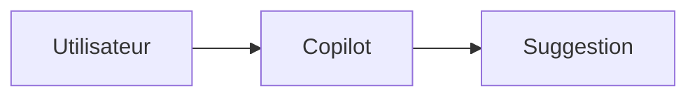

# Patterns de Documentation — Exemples Concrets

## Pattern 1 : Page de fonctionnalité (contenu unique)

Utiliser pour une fonctionnalité qui ne se différencie pas selon l'IDE.

```markdown
# Nom de la Fonctionnalité

<span class="badge-intermediate">Intermédiaire</span>

Courte description de ce que fait cette fonctionnalité (1-2 phrases).

---

## Vue d'ensemble

Explication conceptuelle avec diagramme si utile.



---

## Comment l'utiliser

### Étape 1 — Prérequis

!!! info "Prérequis"
    Listez ici ce qui est nécessaire avant de commencer.

### Étape 2 — Configuration

```yaml
# settings.json (VS Code) ou équivalent
"copilot.feature": true
```

### Étape 3 — Utilisation

Description de l'utilisation avec exemple concret.

!!! tip "Conseil"
    Astuce pour optimiser l'utilisation.

---

## Cas d'usage

### Cas 1 : [Scénario]

```python
# Commentaire décrivant l'intention
# Copilot génère à partir de ce contexte
```

### Cas 2 : [Autre scénario]

...

---

## Limites et précautions

!!! warning "À savoir"
    Limitations connues ou précautions d'usage.

---

## Résumé

- Point clé 1
- Point clé 2
- Point clé 3
```

## Pattern 2 : Page de comparaison IntelliJ / VS Code

```markdown
# Comparaison — [Sujet] IntelliJ vs VS Code

## Présentation

Contexte de la comparaison en 2-3 phrases.

---

## Tableau comparatif

| Critère | IntelliJ IDEA | Visual Studio Code |
|---------|:-------------:|:-----------------:|
| **Fonctionnalité A** | :material-check-circle:{ .green } Oui | :material-close-circle:{ .red } Non |
| **Fonctionnalité B** | Partiel | Complet |

---

## Détail des différences

### [Critère principal]

=== "IntelliJ IDEA"
    Explication détaillée pour IntelliJ.

    ```java
    // Exemple IntelliJ
    ```

=== "Visual Studio Code"
    Explication détaillée pour VS Code.

    ```typescript
    // Exemple VS Code
    ```

---

## Recommandation

!!! tip "Notre recommandation"
    Sur quel IDE privilégier cette fonctionnalité et pourquoi.
```

## Pattern 3 : Tutoriel pas à pas

```markdown
# Tutoriel — [Objectif]

<span class="badge-beginner">Débutant</span> <span class="badge-intellij">IntelliJ</span>

Ce tutoriel vous guide pour [objectif] en [durée estimée].

**Prérequis :** [liste des prérequis]

---

## Étape 1 — [Titre de l'étape]

Description de ce qui se passe dans cette étape.

1. Action concrète à effectuer
2. Deuxième action

!!! info "Résultat attendu"
    Décrivez ce que l'utilisateur doit voir après cette étape.

---

## Étape 2 — [Titre]

...

---

## Vérification finale

!!! success "Ça marche ?"
    Décrivez comment vérifier que le tutoriel s'est bien déroulé.

Si quelque chose ne fonctionne pas, consultez [la page de troubleshooting](../../chapitre-5-troubleshooting/problemes-courants.md).
```

## Pattern 4 : Page de référence rapide

```markdown
# Référence — [Sujet]

<span class="badge-expert">Expert</span>

Page de référence rapide pour [sujet]. Connaissances préalables supposées.

---

## Raccourcis essentiels

| Action | Raccourci |
|--------|-----------|
| [Action] | ++ctrl+alt+a++ |

---

## Configuration

| Paramètre | Valeur | Description |
|-----------|--------|-------------|
| `parametre.name` | `true/false` | Ce que ça fait |

---

## API / Syntaxe

```markdown
# Syntaxe supportée

[exemples]
```

---

## Liens utiles

- [Documentation officielle](#)
- [Page de concepts](../concepts.md)
```

## Pattern 5 : Page de cas d'usage (par langage)

```markdown
# Copilot avec [Langage/Framework]

<span class="badge-intermediate">Intermédiaire</span>

GitHub Copilot adapte ses suggestions au contexte de [Langage]. Cette page couvre les cas d'usage les plus utiles.

---

## Forces de Copilot avec [Langage]

- Force 1
- Force 2
- Force 3

---

## Complétion de code

### [Cas d'usage fréquent]

**Prompt (commentaire) :**

```[language]
// Commentaire décrivant l'intention
```

**Ce que Copilot génère :**

```[language]
// Code généré typique
```

---

## Génération de tests

...

---

## Pièges à éviter

!!! warning "Attention avec [Langage]"
    Particularités ou limitations à connaître.
```
