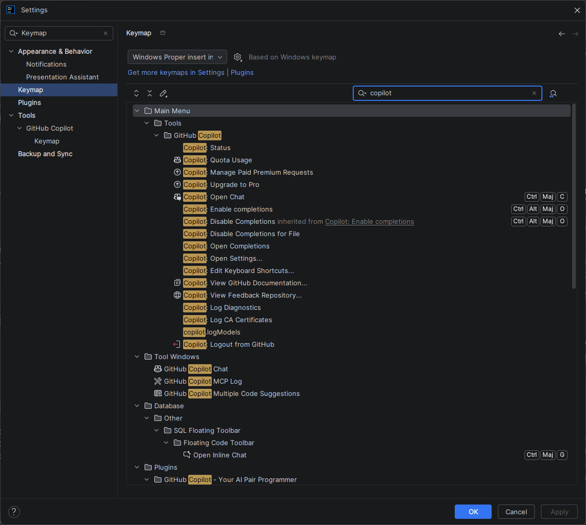
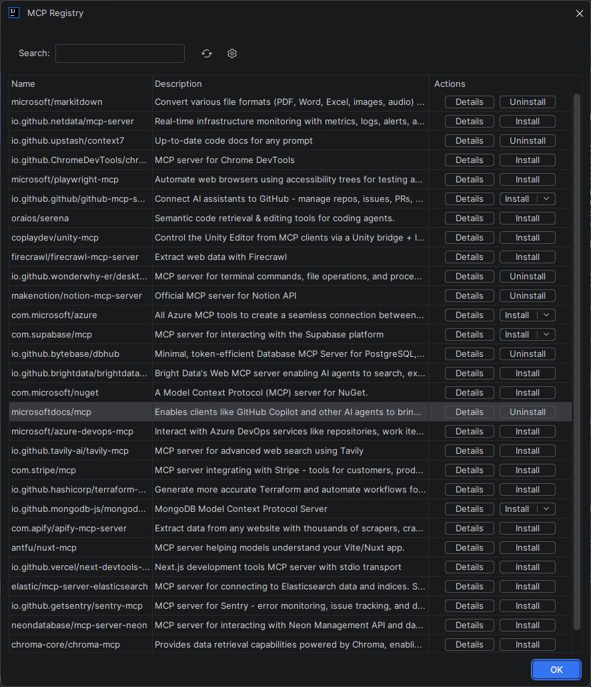

# :simple-intellijidea: Guide de référence — GitHub Copilot sur IntelliJ IDEA

<span class="badge-intellij">IntelliJ IDEA</span> <span class="badge-intermediate">Intermédiaire</span>

## Présentation
Ce guide de référence rassemble toutes les informations techniques sur l'intégration de GitHub Copilot dans IntelliJ IDEA : localisation des fichiers de configuration, raccourcis clavier complets, plugins complémentaires, et personnalisation avancée.

---

## Localisation des fichiers de configuration

IntelliJ IDEA stocke ses configurations dans un dossier propre à chaque version. GitHub Copilot utilise les paramètres standards du plugin, stockés dans ce répertoire.

=== "Windows"

    ```
    %APPDATA%\JetBrains\IntelliJIdea<version>\
    ├── options\
    │   └── github-copilot.xml    ← Paramètres Copilot
    ├── plugins\
    │   └── github-copilot\       ← Fichiers du plugin
    └── logs\
        └── idea.log              ← Logs généraux (inclut Copilot)
    ```

    Exemple pour IntelliJ IDEA 2024.1 :
    ```
    C:\Users\<username>\AppData\Roaming\JetBrains\IntelliJIdea2024.1\options\
    ```

=== "macOS"

    ```
    ~/Library/Application Support/JetBrains/IntelliJIdea<version>/
    ├── options/
    │   └── github-copilot.xml
    ├── plugins/
    │   └── github-copilot/
    └── logs/
    ```

    Exemple :
    ```
    ~/Library/Application Support/JetBrains/IntelliJIdea2024.1/options/
    ```

=== "Linux"

    ```
    ~/.config/JetBrains/IntelliJIdea<version>/
    ├── options/
    │   └── github-copilot.xml
    ├── plugins/
    │   └── github-copilot/
    └── logs/
    ```

    Exemple :
    ```
    ~/.config/JetBrains/IntelliJIdea2024.1/options/
    ```

!!! info "Accès rapide aux logs"
    Dans IntelliJ, accédez directement au dossier de logs via *Help → Show Log in Explorer/Finder/Files Manager*.

---

## Raccourcis clavier par défaut

### Raccourcis principaux — Suggestions inline

=== "Windows / Linux"

    | Action | Raccourci |
    |--------|-----------|
    | **Accepter la suggestion complète** | ++tab++ |
    | **Accepter mot par mot** | ++ctrl+right++ |
    | **Suggestion suivante** | ++alt+bracket-right++ |
    | **Suggestion précédente** | ++alt+bracket-left++ |
    | **Rejeter la suggestion** | ++escape++ |
    | **Déclencher manuellement** | ++alt+backslash++ |
    | **Ouvrir les 10 suggestions** | *(non disponible nativement)* |

=== "macOS"

    | Action | Raccourci |
    |--------|-----------|
    | **Accepter la suggestion complète** | ++tab++ |
    | **Accepter mot par mot** | ++option+right++ |
    | **Suggestion suivante** | ++option+bracket-right++ |
    | **Suggestion précédente** | ++option+bracket-left++ |
    | **Rejeter la suggestion** | ++escape++ |
    | **Déclencher manuellement** | ++option+backslash++ |

### Raccourcis Copilot Chat

=== "Windows / Linux"

    | Action | Raccourci |
    |--------|-----------|
    | **Ouvrir Copilot Chat** | *(panneau latéral)* |
    | **Expliquer le code sélectionné** | Clic droit → *GitHub Copilot → Explain This* |
    | **Générer des tests** | Clic droit → *GitHub Copilot → Generate Tests* |
    | **Corriger le code** | Clic droit → *GitHub Copilot → Fix This* |
    | **Inline Chat (dans l'éditeur)** | ++ctrl+i++ |

=== "macOS"

    | Action | Raccourci |
    |--------|-----------|
    | **Inline Chat (dans l'éditeur)** | ++cmd+i++ |
    | **Expliquer le code sélectionné** | Clic droit → *GitHub Copilot → Explain This* |
    | **Générer des tests** | Clic droit → *GitHub Copilot → Generate Tests* |
    | **Corriger le code** | Clic droit → *GitHub Copilot → Fix This* |

---

## Personnaliser les raccourcis clavier

1. Allez dans *File → Settings → Keymap* (++ctrl+alt+s++ puis rechercher "Keymap")
2. Dans la barre de recherche du Keymap, tapez **"Copilot"** pour filtrer toutes les actions Copilot
3. Double-cliquez sur un raccourci pour le modifier
4. Appuyez sur la combinaison de touches souhaitée
5. Cliquez sur **OK** pour confirmer

{ .doc-screenshot }
*Capture d'ecran : Panneau Keymap filtré sur "Copilot"*

!!! tip "Exporter votre keymap"
    Vous pouvez exporter votre keymap personnalisée via *File → Export Settings* pour la partager avec l'équipe ou la restaurer après une réinstallation.

---

## Menu contextuel (clic droit)

Lorsque vous sélectionnez du code et faites un clic droit, le sous-menu **GitHub Copilot** propose :

| Option | Description |
|--------|-------------|
| **Explain This** | Copilot explique le code sélectionné dans le Chat |
| **Generate Tests** | Génère des tests unitaires pour la méthode/classe sélectionnée |
| **Fix This** | Propose une correction pour le code problématique |
| **Simplify This** | Suggère une version simplifiée du code |
| **Generate Docs** | Génère la documentation (Javadoc, KDoc, etc.) |

---

## Plugins complémentaires recommandés

Ces plugins de la suite JetBrains/Marketplace s'intègrent bien avec Copilot :

| Plugin | Utilité | Lien |
|--------|---------|------|
| **GitHub** | Intégration Pull Requests, Issues, Actions directement dans l'IDE | JetBrains Marketplace |
| **SonarLint** | Analyse de qualité en temps réel — complémentaire à Copilot pour la sécurité | JetBrains Marketplace |
| **Conventional Commits** | Aide à la rédaction des messages de commit — combinable avec Copilot | JetBrains Marketplace |
| **String Manipulation** | Transformations de chaînes utiles quand on travaille avec des suggestions | JetBrains Marketplace |

!!! warning "Éviter les conflits d'autocomplétion"
    Si vous utilisez d'autres plugins d'IA ou d'autocomplétion (Tabnine, Kite, AWS CodeWhisperer), ils peuvent entrer en conflit avec Copilot. Désactivez-les ou configurez leurs priorités pour éviter d'avoir deux suggestions simultanées.

---

## Accès rapide aux paramètres Copilot

Depuis la barre d'état (icône Copilot en bas) :
- Cliquez sur l'icône pour voir l'état (actif/inactif)
- Clic droit sur l'icône → menu rapide : Enable/Disable, Open Settings, Login/Logout

Depuis le menu principal :
- **Tools → GitHub Copilot** → accès à toutes les options

Pour les paramètres complets : [Paramétrage IntelliJ](../../chapitre-2-parametrage/intellij-parametrage.md)

---

## Informations de version et diagnostic

Pour connaître la version du plugin installée :
1. *File → Settings → Plugins → Installed*
2. Recherchez "GitHub Copilot"
3. La version s'affiche sous le nom du plugin

Pour accéder aux logs Copilot détaillés : voir [Logs & Diagnostic](../../chapitre-5-troubleshooting/logs-diagnostic.md)

---

## MCP Registry — Enrichir le contexte avec des serveurs MCP

<span class="badge-advanced">Avancé</span>

### Qu'est-ce que MCP ?

**Model Context Protocol (MCP)** est un protocole standard qui permet d'enrichir le contexte de Copilot en connectant des serveurs MCP spécialisés. Ces serveurs donnent accès à des ressources externes (bases de données, APIs, fichiers, outils CLI, etc.) directement dans votre éditeur.

### Accéder à MCP Registry dans IntelliJ

Pour découvrir et installer des serveurs MCP dans IntelliJ :

1. Allez dans *Tools → GitHub Copilot → MCP Server Registry*
2. Ou utilisez la **barre de recherche rapide** : ++shift+shift++ , tapez "MCP Registry"

La fenêtre **MCP Registry** s'affiche avec une liste de serveurs disponibles :

<figure markdown="span">
    { width="600" }
  <figcaption>MCP Registry — Sélection et installation de serveurs MCP dans IntelliJ</figcaption>
</figure>

### Serveurs MCP populaires

| Serveur | Utilité | Fonction |
|---------|---------|----------|
| **microsoft/markdown** | Conversion de formats | Convertir fichiers (PDF, Word, Excel, images, audio) en Markdown |
| **io.github.netdata/mcp-server** | Monitoring | Surveillance temps-réel avec Datadog/Netdata |
| **io.github.upstash/context7** | Documentation | Accès à documentation à jour pour les libraries |
| **io.github.ChromeDevTools/chromedevtools** | DevTools Chrome | Automatiser les tests de navigateur |
| **microsoft/playwright-mcp** | Test d'accessibilité | Tester l'accessibilité web avec Playwright |
| **io.github.github/github-mcp-server** | GitHub | Gérer repos, issues, PRs directement |
| **oraios/serena** | Récupération sémantique | Recherche et édition pour agents |
| **firecrawl/firecrawl-mcp-server** | Web scraping | Extraire données structurées du web |
| **b-phoenix/govdash** | Terminal CLI | Exécuter commandes et scripts |
| **makenotation/notion-mcp-server** | Notion API | Intégration Notion |
| **com.microsoft/azure** | Azure | Tous les outils Azure MCP |
| **com.supabase/mcp** | Supabase | Interactions avec Supabase |
| **io.github.bytebase/dbhub** | Database | Serveur MCP pour PostgreSQL |

### Installation d'un serveur MCP

1. Dans la fenêtre **MCP Registry**, cliquez sur un serveur de la liste
2. Consultez la description et les prérequis affichés
3. Cliquez sur le bouton **"Install"** ou **"Add"**
4. IntelliJ configure automatiquement le serveur et l'active

### Vérifier les serveurs MCP installés

Pour voir les serveurs activés et leurs statuts :

1. Allez dans *Tools → GitHub Copilot → MCP Server Manager*
2. Vous verrez la liste des serveurs avec leur statut (Active/Inactive)
3. Vous pouvez activer/désactiver chacun individuellement

### Utiliser un serveur MCP dans Copilot Chat

Une fois installé, utilisez le serveur dans le Chat IntelliJ :

1. Ouvrez le **Copilot Chat** (panneau latéral droit ou ++ctrl+i++)
2. Tapez `@` dans le message pour voir les serveurs disponibles
3. Sélectionnez le serveur pour le contexte de votre question :
   
```
@markdown Convertis ce fichier PDF en markdown lisible
@github Affiche mes pull requests en attente
@context7 Quelle est la dernière version de React ?
```

Copilot utilisera automatiquement le serveur sélectionné pour enrichir sa réponse.

### Configuration avancée

IntelliJ gère la configuration MCP via son système de plugins et preferences. Les paramètres avancés sont visibles dans :

*File → Settings → Tools → GitHub Copilot → MCP Configuration*

Ici, vous pouvez :
- Activer/désactiver individuellement chaque serveur
- Configurer les variables d'environnement (tokens, API keys)
- Définir les priorités et timeouts
- Consulter les logs de connexion de chaque serveur

!!! warning "Variables d'environnement"
    Les serveurs MCP peuvent nécessiter des tokens d'authentification (GitHub, API keys, etc.). Stockez-les dans les **variables d'environnement du système** :
    
    === "Windows (PowerShell)"
        ```powershell
        [Environment]::SetEnvironmentVariable("GITHUB_TOKEN", "ghp_xxxxx", "User")
        ```
    
    === "macOS / Linux"
        ```bash
        export GITHUB_TOKEN="ghp_xxxxx"
        # Ajouter à ~/.bashrc ou ~/.zshrc pour la persistance
        ```
    
    Redémarrez IntelliJ pour que les changements prennent effet.

---

