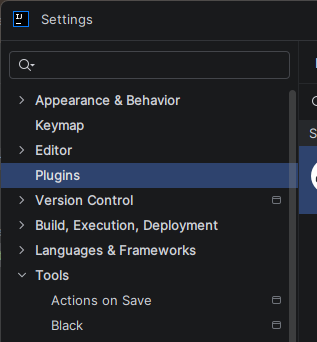
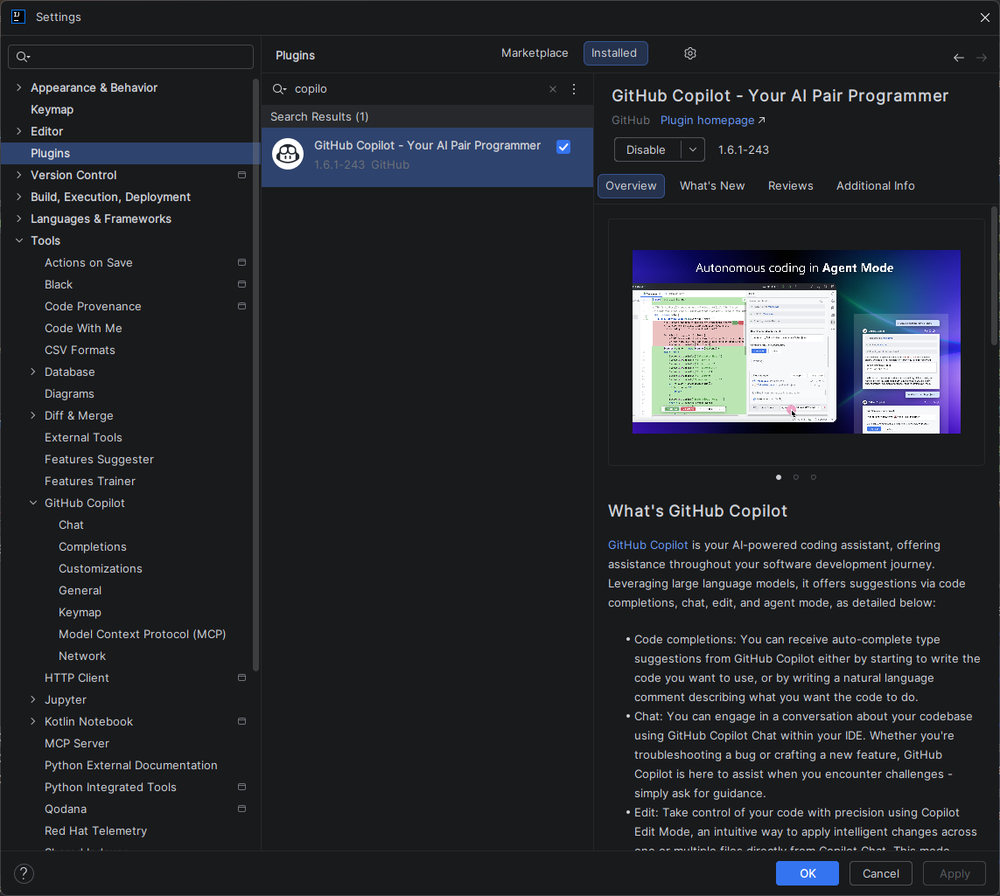
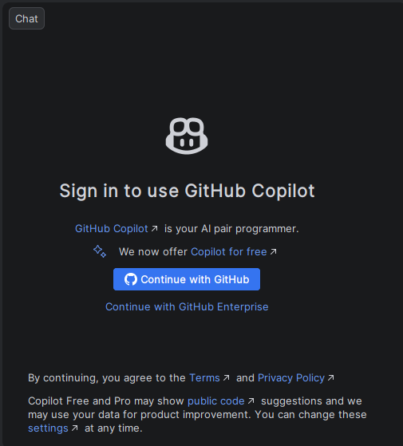
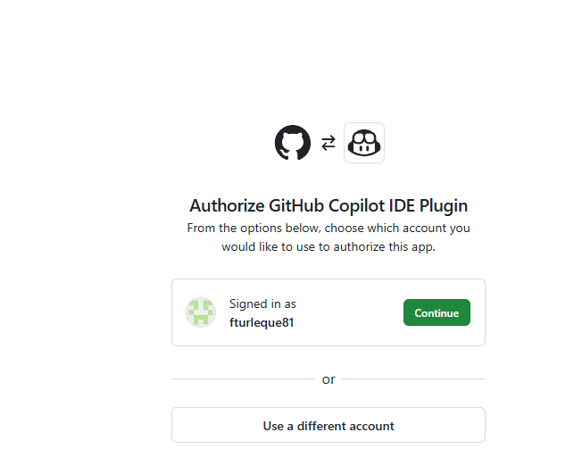

# :simple-intellijidea: Tutoriel — Installer GitHub Copilot sur IntelliJ IDEA

<span class="badge-intellij">IntelliJ IDEA</span> <span class="badge-beginner">Débutant</span>

## Présentation
Ce tutoriel vous guide pas à pas pour installer et configurer GitHub Copilot sur IntelliJ IDEA (et sur toute la suite JetBrains : PyCharm, WebStorm, GoLand, Rider, etc.). Durée estimée : **5 à 8 minutes**.

---

## Prérequis

Avant de commencer, vérifiez :

- [ ] IntelliJ IDEA version **2023.1 ou supérieure** (vérifiable via *Help → About*)
- [ ] Un compte GitHub avec un abonnement **Copilot actif** ([vérifier ici](https://github.com/settings/copilot))
- [ ] Une connexion internet active
- [ ] Si vous développez en Java : un JDK installé (recommandé : JDK 17+)

!!! warning "Version IntelliJ"
    Le plugin GitHub Copilot nécessite au minimum IntelliJ IDEA 2023.1. Sur des versions antérieures, le plugin n'apparaîtra pas dans le Marketplace ou ne fonctionnera pas correctement.
    
    Pour mettre à jour IntelliJ : *Help → Check for Updates*

---

## Étape 1 — Ouvrir le gestionnaire de plugins

1. Lancez IntelliJ IDEA
2. Dans la barre de menu, cliquez sur **File** (Windows/Linux) ou sur le nom de l'application (macOS)
3. Sélectionnez **Settings** (Windows/Linux) ou **Preferences** (macOS)
   - Raccourci : ++ctrl+alt+s++ (Windows/Linux) / ++cmd+comma++ (macOS)
4. Dans le panneau de gauche, cliquez sur **Plugins**

{ .doc-screenshot }       
*Capture d'ecran : File → Settings → Plugins*

!!! tip "Raccourci direct"
    Vous pouvez aussi accéder aux Plugins via la barre de recherche rapide : appuyez sur ++shift++ deux fois pour ouvrir **Search Everywhere**, puis tapez "Plugins".

---

## Étape 2 — Rechercher GitHub Copilot dans le Marketplace

1. Dans la fenêtre Plugins, assurez-vous d'être sur l'onglet **Marketplace** (pas "Installed")
2. Dans la barre de recherche en haut, tapez : **GitHub Copilot**
3. Vous devriez voir apparaître le plugin officiel **"GitHub Copilot"** développé par *GitHub*

{ .doc-screenshot }     
*Capture d'ecran : Résultat de recherche "GitHub Copilot" dans le Marketplace*

!!! danger "Vérifiez l'éditeur du plugin"
    Assurez-vous que le plugin est bien publié par **GitHub** (vérifié avec badge ✓). Il existe des plugins tiers imitateurs — installez uniquement l'officiel.

---

## Étape 3 — Installer le plugin

1. Cliquez sur la carte du plugin **GitHub Copilot**
2. Cliquez sur le bouton **Install** (bouton vert)
3. Acceptez les conditions d'utilisation si une boîte de dialogue apparaît
4. Attendez la fin du téléchargement (quelques secondes selon votre connexion)
5. Une fois installé, cliquez sur **Restart IDE**

!!! info "Redémarrage obligatoire"
    IntelliJ doit redémarrer pour charger le plugin. Sauvegardez votre travail en cours avant de cliquer sur "Restart IDE". Tous vos projets ouverts seront restaurés automatiquement.

---

## Étape 4 — Authentification avec GitHub

Après le redémarrage d'IntelliJ :

1. Une notification **"GitHub Copilot"** peut apparaître automatiquement en bas à droite — cliquez dessus
2. Sinon, allez dans le menu **Tools → GitHub Copilot → Login to GitHub**
3. Une boîte de dialogue s'ouvre avec un **code de vérification unique** (ex: `AB12-CD34`)

{ .doc-screenshot }       
*Capture d'ecran : Boîte de dialogue avec code de vérification*

4. Cliquez sur **Copy and Open** — le code est copié et votre navigateur s'ouvre automatiquement
5. Sur la page GitHub qui s'ouvre, **collez le code** dans le champ prévu
6. Cliquez sur **Continue**, puis **Authorize GitHub Copilot Plugin**
7. GitHub vous demandera peut-être votre mot de passe ou une authentification 2FA
8. Une fois autorisé, un message de confirmation s'affiche dans le navigateur
9. Revenez dans IntelliJ — Copilot est maintenant authentifié

{ .doc-screenshot }     
*Capture d'ecran : Page d'autorisation GitHub dans le navigateur*

!!! tip "Le navigateur ne s'ouvre pas ?"
    Copiez manuellement l'URL affichée dans la boîte de dialogue et collez-la dans votre navigateur. Le code de vérification reste valide pendant 15 minutes.

---

## Étape 5 — Vérifier le fonctionnement

**Vérification visuelle :**

1. Regardez la barre d'état en bas de la fenêtre IntelliJ
2. Vous devriez voir une icône Copilot (un symbole ressemblant à un copilote/casque)
3. Si l'icône est présente et active, Copilot est opérationnel

!!! note "Capture à ajouter"
    Capture d'écran attendue : **Icône Copilot dans la barre d'état IntelliJ**.
    Fichier image attendu : `docs/assets/images/intellij/status-bar-icon.png`.

**Vérification par un test pratique :**

1. Ouvrez ou créez un fichier Java (ex: `Test.java`)
2. Créez une nouvelle méthode avec un commentaire descriptif :

```java
public class Test {
    // Méthode qui calcule la factorielle d'un nombre entier
    public int factorielle(int n) {
```

3. Après avoir tapé l'accolade `{`, attendez 1 à 2 secondes
4. Une suggestion Copilot devrait apparaître en **gris italique** dans l'éditeur
5. Appuyez sur ++tab++ pour accepter la suggestion

!!! success "Ça fonctionne !"
    Si vous voyez la suggestion grisée s'afficher, GitHub Copilot est correctement installé et opérationnel.

---

## Étape 6 — Activer Copilot Chat (inclus)

Contrairement à VS Code, Copilot Chat est **inclus dans le plugin IntelliJ** sans installation séparée.

Pour ouvrir le chat :
- Cliquez sur l'icône **Copilot Chat** dans la barre latérale droite
- Ou via le menu **Tools → GitHub Copilot → Open GitHub Copilot Chat**
- Raccourci (si configuré) : consultez la section raccourcis dans le [Guide de référence](reference.md)

<div class="img-placeholder">
📸 Capture d'écran : Panneau Copilot Chat ouvert dans IntelliJ
</div>

---

## Pièges à éviter

!!! danger "Pièges courants lors de l'installation"

    **1. Version IntelliJ trop ancienne**
    Le plugin ne sera pas visible dans le Marketplace ou refusera de s'installer.
    ✅ Solution : mettez à jour IntelliJ via *Help → Check for Updates*

    **2. Plugin installé mais pas de suggestions**
    Il peut s'agir d'un problème d'authentification non complété.
    ✅ Solution : *Tools → GitHub Copilot → Login to GitHub* et recommencez

    **3. Suggestions uniquement en anglais**
    C'est le comportement par défaut. Copilot génère du code (qui est en anglais), mais vous pouvez interagir avec Chat en français.
    ✅ Voir [Paramétrage](../../chapitre-2-parametrage/intellij-parametrage.md) pour la configuration de langue

    **4. Icône Copilot absente dans la barre d'état**
    Copilot est peut-être désactivé pour le projet ouvert.
    ✅ Cliquez sur *Tools → GitHub Copilot → Enable Completions*

    **5. Conflit avec un autre plugin d'autocomplétion**
    Certains plugins comme Tabnine peuvent créer des conflits.
    ✅ Désactivez temporairement les autres plugins d'IA pour tester

---

## Prochaines étapes

- [Guide de référence IntelliJ](reference.md) — Raccourcis, localisation des settings, plugins complémentaires
- [Paramétrage IntelliJ](../../chapitre-2-parametrage/intellij-parametrage.md) — Configurer Copilot pour votre workflow
- [Comparaison IntelliJ vs VS Code](../comparaison.md) — Différences d'installation et de fonctionnement

