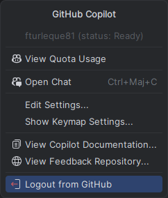
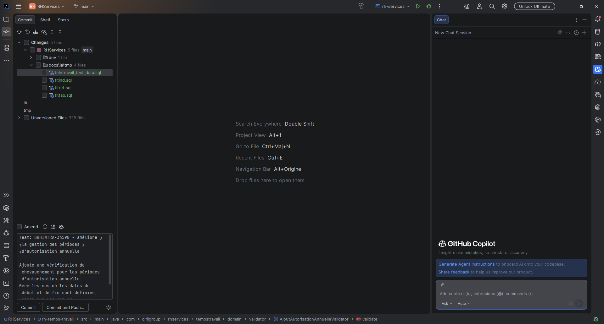

# :simple-intellijidea: Tutoriel — Installer GitHub Copilot sur IntelliJ IDEA

<span class="badge-intellij">IntelliJ IDEA</span> <span class="badge-beginner">Débutant</span>

## Présentation

Ce tutoriel vous guide pas à pas pour installer et configurer GitHub Copilot sur **IntelliJ IDEA** (et toute la suite JetBrains : PyCharm, WebStorm, GoLand, Rider, etc.). Durée estimée : **5 minutes**.

GitHub Copilot sur IntelliJ IDEA permet de :

- Recevoir des suggestions de code en temps réel (inline)
- Utiliser Copilot Chat pour questions et refactorings
- Effectuer des modifications multi-fichiers automatisées (Agents)
- Intégration native avec l'analyse sémantique JetBrains (PSI)

---

## Prérequis

Avant de commencer, vérifiez :

- [ ] **IntelliJ IDEA 2024.1+** (ou PyCharm/WebStorm/GoLand équivalent) — vérifiable via *Help → About*
- [ ] **Compte GitHub actif** avec accès à Copilot (Free/Pro/Enterprise)
- [ ] **Connexion internet** (authentification OAuth)
- [ ] (Optionnel) **JDK 21+** si vous développez en Java

Vérifiez votre version : *Help → About* (doit afficher "IntelliJ IDEA 2024.x" ou supérieur)

!!! warning "Version insuffisante ?"
    Le plugin Copilot nécessite **IntelliJ 2024.1 minimum**. Les versions anciennes (2023.x) ne supportent pas toutes les features modernes (Agents, Edits).
    
    Mettez à jour via *Help → Check for Updates* ou [jetbrains.com/idea](https://www.jetbrains.com/idea/)

---

## :material-folder-open: Étape 1 — Ouvrir le gestionnaire de plugins

Ouvrez IntelliJ IDEA et accédez au **gestionnaire de plugins**.

### :keyboard: Méthode 1 : Raccourci clavier

- **Windows/Linux** : ++ctrl+alt+s++ (Settings) → *Plugins*
- **macOS** : ++cmd+comma++ (Preferences) → *Plugins*

### :material-menu: Méthode 2 : Menu principal

1. Cliquez *File* (Windows/Linux) ou le nom de l'app (macOS)
2. Sélectionnez *Settings* (Windows/Linux) ou *Preferences* (macOS)
3. Dans le volet gauche : *Plugins*

<figure markdown>
  { .reduced-screenshot }
  <figcaption markdown="span">:material-camera: Gestionnaire de plugins via Settings</figcaption>
</figure>

### :material-magnify: Méthode 3 : Recherche rapide

- Appuyez ++shift++ + ++shift++ pour ouvrir *Search Everywhere*
- Tapez : `"Plugins"`
- Appuyez ++enter++

!!! tip "Raccourci direct"
    Vous pouvez aussi accéder aux Plugins directement via la barre de recherche rapide (*Search Everywhere*) : appuyez sur ++shift+shift++, puis tapez `"Plugins"`.

!!! example "Vous verrez :"
    Le gestionnaire de plugins avec onglets : *Marketplace*, *Installed*, *Updates*

---

## :material-download: Étape 2 — Installer GitHub Copilot

### :material-list-box: Étapes d'installation

1. Assurez-vous d'être sur l'onglet **Marketplace** (pas "Installed")
2. Tapez **`GitHub Copilot`** dans la barre de recherche
3. Le **premier résultat** doit être publié par `GitHub` (avec badge ✓)
4. Cliquez **Install** 

<figure markdown>
  { .doc-screenshot }
  <figcaption markdown="span">:material-camera: Résultats de recherche « GitHub Copilot »</figcaption>
</figure>

!!! danger "Vérifiez l'éditeur du plugin"
    Assurez-vous que le plugin est bien publié par **GitHub** (vérifié avec badge ✓). Il existe des plugins tiers imitateurs — installez uniquement l'officiel (identifiant : `com.github.copilot`).


### Après l'installation

Le gestionnaire affiche : **Restart IDE** (bouton bleu)

---

## :material-restart: Étape 3 — Redémarrer IntelliJ

Cliquez **Restart IDE**. IntelliJ relance automatiquement.

!!! warning "Redémarrage obligatoire"
    IntelliJ doit redémarrer pour charger le plugin. Sauvegardez votre travail en cours avant de cliquer sur **Restart IDE**. Tous vos projets ouverts seront restaurés automatiquement.

## :material-github: Étape 4 — Authentification avec GitHub

Après redémarrage, authentifiez-vous avec votre compte GitHub.

### :material-bell: Cas 1 : Notification automatique

1. Une notification **"GitHub Copilot"** peut apparaître automatiquement en bas à droite → cliquez-la

### :material-cursor-default-click: Cas 2 : Authentification manuelle

1. Menu : *Tools → GitHub Copilot → Login to GitHub*
   - Ou recherche rapide (++shift+shift++) : `"Login to GitHub"`
2. Une **boîte de dialogue** s'ouvre avec un code de vérification unique (ex: `AB12-CD34`)

<figure markdown>
  { .doc-screenshot }
  <figcaption markdown="span">:material-camera: Boîte de dialogue avec code de vérification</figcaption>
</figure>

3. Cliquez **Copy and Open** — le code est copié et votre navigateur s'ouvre automatiquement
4. Sur la page GitHub qui s'ouvre, collez le code dans le champ prévu

### :material-web: Processus navigateur

1. Connexion GitHub (si nécessaire)
2. Collez le code de vérification dans le champ prévu
3. Cliquez **Continue**, puis **Authorize GitHub Copilot Plugin**
4. GitHub peut demander votre mot de passe ou une authentification 2FA
5. Une fois autorisé, un message de confirmation s'affiche dans le navigateur
6. Revenez dans IntelliJ — Copilot est maintenant authentifié

<figure markdown>
  { .doc-screenshot }
  <figcaption markdown="span">:material-camera: Page d'autorisation GitHub dans le navigateur</figcaption>
</figure>

!!! tip "Le navigateur ne s'ouvre pas ?"
    Copiez manuellement l'URL affichée dans la boîte de dialogue et collez-la dans votre navigateur. Le code de vérification reste valide pendant **15 minutes**.

## :material-check-circle: Étape 5 — Vérifier que Copilot est actif

### :material-check: Vérification rapide

1. Regardez la **barre de statut en bas à droite** d'IntelliJ
2. Vous devez voir l'icône Copilot (éclair/logo)
3. **Vert** ou sans point rouge = actif ✅ ou (status: Ready)

<figure markdown>
  { .reduced-screenshot }
  <figcaption markdown="span">:material-camera: Icône Copilot active dans la barre de statut</figcaption>
</figure>

### :material-play: Test rapide

1. Créez un nouveau fichier : *File → New → Java Class* (ou autre langage)
2. Tapez `// TODO: fonction pour` 
3. Appuyez ++enter++ et continuez
4. Après 1-2 sec, une suggestion grise devrait apparaître
5. Appuyez ++tab++ pour accepter, ++escape++ pour rejeter

!!! example "Exemple Java :"
    ```java
    // TODO: fonction pour trier une liste de utilisateurs par nom
    public List<User>
    ```
    
    Copilot suggère (en gris) :
    ```java
    public List<User> sortUsersByName(List<User> users) {
        return users.stream()
            .sorted(Comparator.comparing(User::getName))
            .collect(Collectors.toList());
    }
    ```
    
    ++tab++ = accepter la suggestion

!!! success "Ça fonctionne !"
    Si vous voyez la suggestion grisée s'afficher dans l'éditeur, GitHub Copilot est correctement installé et opérationnel. Appuyez sur ++tab++ pour accepter.

## :material-chat: Bonus — Votre première interaction avec Copilot Chat

Testez le chat interactif dès maintenant.

### :material-chat-outline: Ouvrir Copilot Chat

- **Windows/Linux** : ++ctrl+shift+a++
- **macOS** : ++cmd+shift+a++
- Ou *Tools → GitHub Copilot → Open Chat*

### :material-lightbulb: Première question

1. Le panneau **Chat** s'ouvre à droite

<figure markdown>
  { .doc-screenshot }
  <figcaption markdown="span">:material-camera: Panneau Copilot Chat dans la barre latérale</figcaption>
</figure>

2. Tapez une question simple :
   ```
   Comment implémenter un HashMap custom en Java ?
   ```

3. Copilot répond avec explication + exemples de code

### Raccourcis Chat disponibles

- **Ouvrir Chat** : ++ctrl+shift+a++ (Windows/Linux) / ++cmd+shift+a++ (macOS)
- **Inline Chat** : ++shift+enter++ (dans éditeur)
- **Slash commands** : `/explain`, `/fix`, `/tests`, `/doc`

---

## Prochaines étapes

### 1. **Découvrir les raccourcis** (5 min)
→ [Guide Référence — Raccourcis complets](reference.md)

Apprenez :
- Accepter suggestions (++tab++, navigation alternatives)
- Déclencher Copilot manuellement (++ctrl+backslash++)
- Ouvrir Chat (++ctrl+shift+a++)

### 2. **Personnaliser vos préférences** (10 min)
→ [Paramétrage avancé](../../chapitre-2-parametrage/intellij-parametrage.md)

Configurez :
- Activation par langage
- Mode manual vs auto
- Raccourcis clavier personnalisés

### 3. **Apprendre les best practices** (15 min)
→ [Utilisation Effective](../../chapitre-4-bonnes-pratiques/utilisation-effective.md)

Maîtrisez :
- Écrire des prompts efficaces
- Valider le code généré
- Quand utiliser Chat vs Agents

### 4. **Explorer personnalisation & contexte** (20+ min)
→ [Contexte & Personnalisation IntelliJ](../../chapitre-3-contexte/intellij-contexte.md)

Avancé :
- Custom instructions par projet
- Multi-module Maven/Gradle setup
- PSI integration (analyse sémantique profonde)

---

## Foire aux questions

**Q : Copilot ne suggère rien. Qu'est-ce qui ne va pas ?**

A : Vérifiez :
- [ ] Plugin GitHub Copilot installé (Settings → Plugins)
- [ ] IntelliJ relancé après installation
- [ ] Vous êtes authentifié (icône Copilot visible en bas)
- [ ] Copilot activé pour ce langage (Settings → GitHub Copilot)

**Q : Je vois une erreur d'authentification .

A :
1. Menu : *Tools → GitHub Copilot → Logout*
2. Attendez 10 secondes
3. *Tools → GitHub Copilot → Login to GitHub*
4. Reconnectez-vous

**Q : Copilot suggère du code de mauvaise qualité.**

A : C'est normal — **vous êtes responsable** de vérifier. Lisez la section [Best Practices](../../chapitre-4-bonnes-pratiques/utilisation-effective.md) pour apprendre à valider.

---

## Pièges à éviter

!!! danger "Pièges courants lors de l'installation"

    **1. Version IntelliJ trop ancienne**
    Le plugin ne sera pas visible dans le Marketplace ou refusera de s'installer.
    ✅ Solution : mettez à jour IntelliJ via *Help → Check for Updates*

    **2. Plugin installé mais pas de suggestions**
    Il peut s'agir d'un problème d'authentification non complété.
    ✅ Solution : *Tools → GitHub Copilot → Login to GitHub* et recommencez

    **3. Suggestions uniquement en anglais**
    C'est le comportement par défaut. Copilot génère du code (qui est en anglais), mais vous pouvez interagir avec Chat en français.
    ✅ Voir [Paramétrage](../../chapitre-2-parametrage/intellij-parametrage.md) pour la configuration de langue

    **4. Icône Copilot absente dans la barre d'état**
    Copilot est peut-être désactivé pour le projet ouvert.
    ✅ Cliquez sur *Tools → GitHub Copilot → Enable Completions*

    **5. Conflit avec un autre plugin d'autocomplétion**
    Certains plugins comme Tabnine peuvent créer des conflits.
    ✅ Désactivez temporairement les autres plugins d'IA pour tester

---

## Prochaines étapes

- [Guide de référence IntelliJ](reference.md) — Raccourcis, localisation des settings, plugins complémentaires
- [Paramétrage IntelliJ](../../chapitre-2-parametrage/intellij-parametrage.md) — Configurer Copilot pour votre workflow
- [Comparaison IntelliJ vs VS Code](../comparaison.md) — Différences d'installation et de fonctionnement

