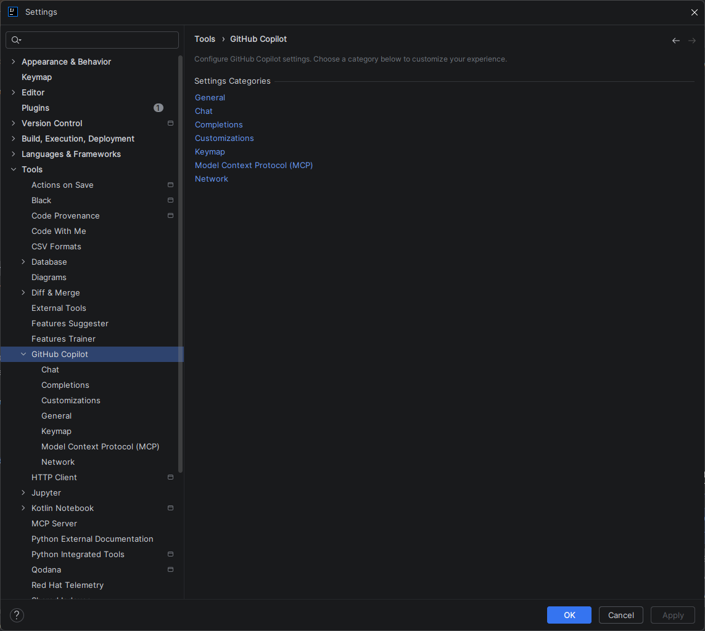
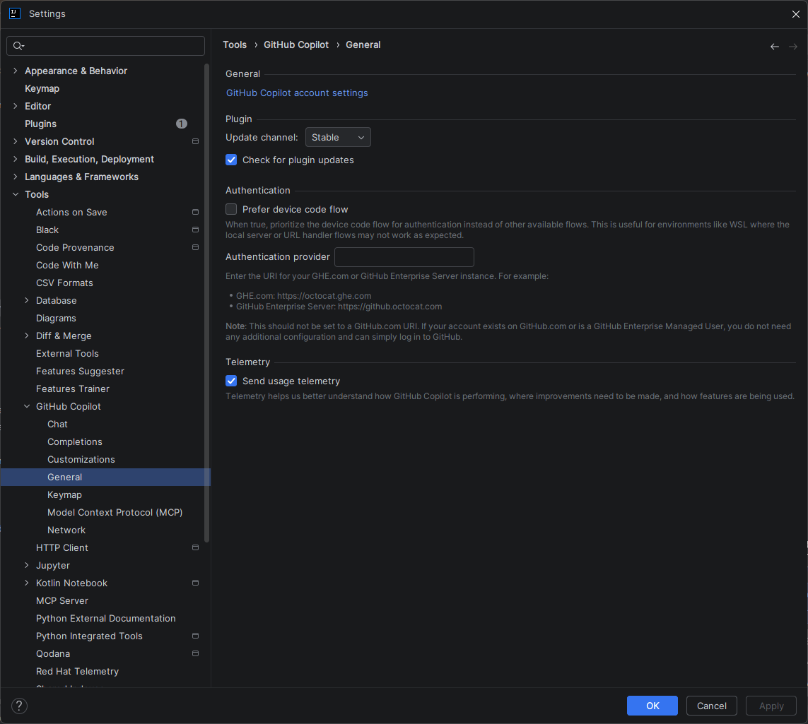
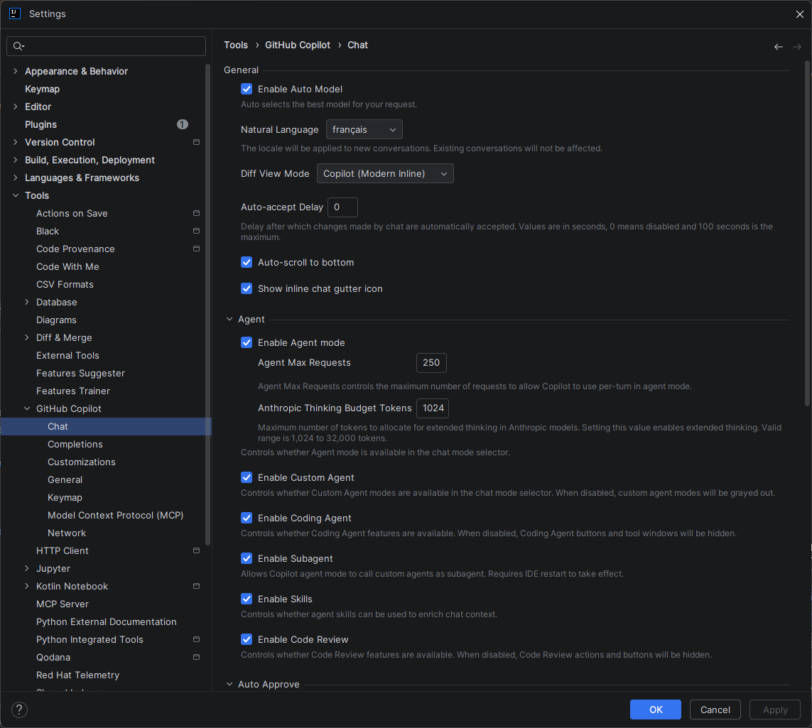
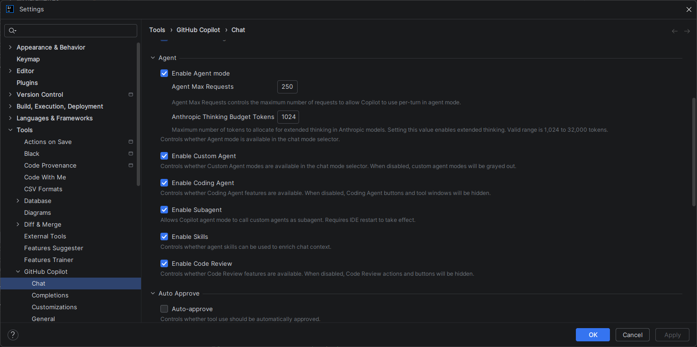
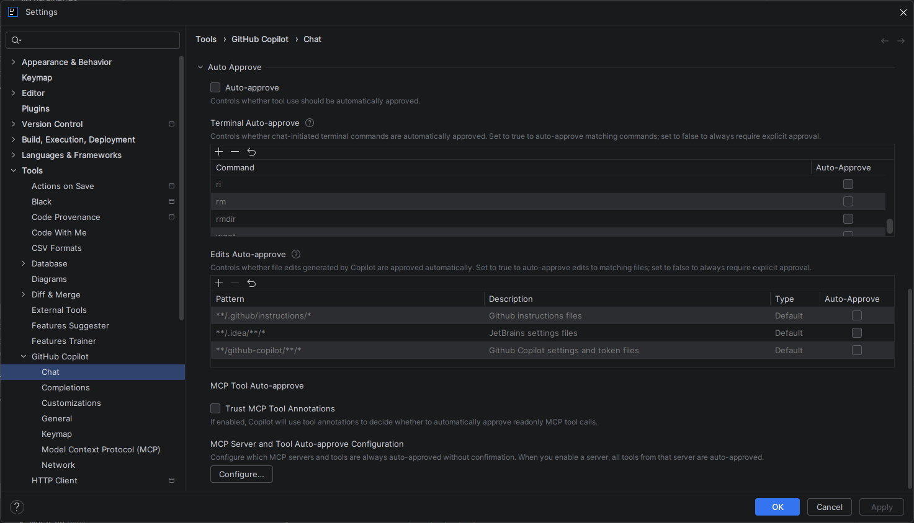
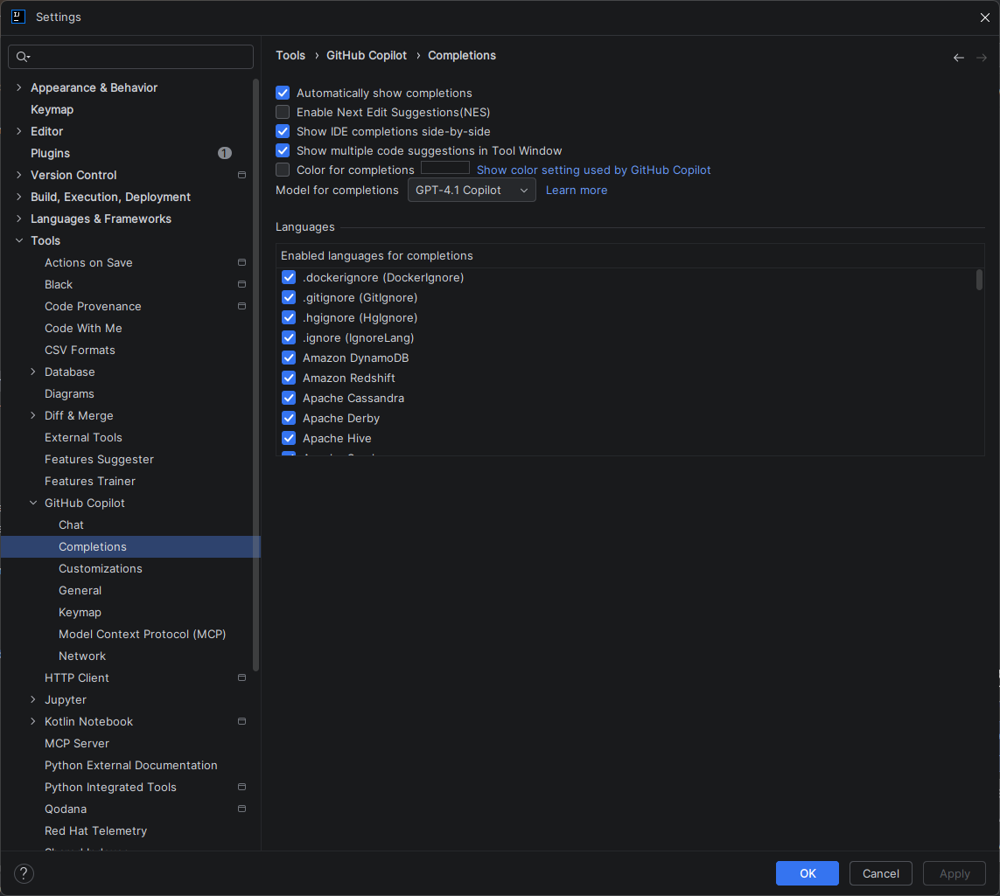
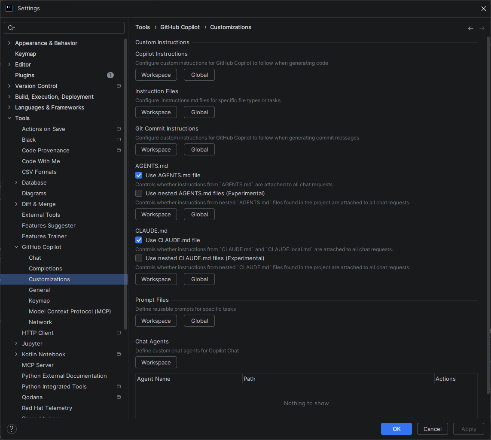

# :simple-intellijidea: Paramétrage Complet — GitHub Copilot sur IntelliJ IDEA

<span class="badge-intellij">IntelliJ IDEA</span> <span class="badge-intermediate">Intermédiaire</span>

!!! info "Version 2025.3.4+"
    Cette documentation s'applique à **IntelliJ IDEA 2025.3.4 et versions récentes**. L'interface GitHub Copilot a été structurée avec les catégories : General, Chat, Completions, Customizations, Keymap, MCP, Network. Les paramètres des versions antérieures diffèrent.

!!! warning "Raccourcis clavier — valeurs par défaut uniquement"
    Tous les raccourcis mentionnés dans cette page correspondent aux **valeurs par défaut** d'IntelliJ IDEA. Selon votre keymap (AZERTY, IdeaVim, Emacs, schéma personnalisé d'entreprise), ces raccourcis peuvent ne pas fonctionner ou être mappés différemment. Consultez la [section Keymap](#keymap) pour vérifier et adapter vos raccourcis.

## Accès aux paramètres

Trois façons d'accéder aux paramètres GitHub Copilot :

### 1️⃣ Via le menu principal

1. *File → Settings* (Windows/Linux) ou *IntelliJ IDEA → Preferences* (macOS)
   - Raccourci : ++ctrl+alt+s++ / ++cmd+comma++
2. Cherchez **GitHub Copilot** dans le panneau de gauche et expandez-le

### 2️⃣ Via l'icône dans la barre d'état

- Cliquez sur l'icône Copilot en bas à droite de la fenêtre
- Sélectionnez **"Open GitHub Copilot Settings"**

### 3️⃣ Via le menu Tools

- *Tools → GitHub Copilot → Settings...*

**Page d'accueil des paramètres :**

Une fois ouvert, vous voyez une page de catégorisation avec 6 catégories principales :

{ .doc-screenshot }
*Catégories des paramètres GitHub Copilot*

---

## Catégories des paramètres

Les paramètres GitHub Copilot sont organisés en 6 catégories principales. Explorez chaque section selon vos besoins :

### 🔧 General

#### Authentification et gestion du plugin

- **GitHub Copilot account settings** — Gérez votre compte GitHub, authentification device code flow ou custom enterprise URI
- **Plugin updates** — Canal de mise à jour (Stable / Beta), vérification automatique
- **Send usage telemetry** — Optionnel ; permet à GitHub d'améliorer Copilot

{ .doc-screenshot }
*Paramètres généraux : compte, mise à jour, authentification, télémétrie*

#### Quand l'utiliser

Lors de la première configuration, ou pour changer de compte GitHub.

---

### 💬 Chat

#### Configuration des agents et du mode Chat

- **Enable Auto Model** — Sélectionne automatiquement le meilleur modèle pour votre requête
- **Natural Language** — Langue des interactions (français, anglais, etc.)
- **Diff View Mode** — Comment afficher les différences (inline, side-by-side)
- **Auto-accept Delay** — Temps avant acceptation automatique (0 = désactivé)
- **Auto-scroll to bottom** — Remonte automatiquement au dernier message
- **Show inline chat gutter icon** — Affiche l'icône du chat inline

{ .doc-screenshot }
*Paramètres généraux du Chat : auto-model, langue, affichage*

**Mode Agent (avancé) :**

- **Enable Agent mode** — Autorise Copilot à exécuter des commandes autonomes
- **Enable Custom Agent** — Active les agents personnalisés définis dans `AGENTS.md`
- **Enable Coding Agent** — Active les actions de génération/modification de code
- **Enable Subaagent** — Permet aux agents d'invoquer d'autres agents
- **Enable Skills** — Active les compétences spécialisées
- **Enable Code Review** — Active les revues de code assistées

#### Agent Max Requests

Quand le mode Agent est actif, Copilot peut effectuer des **actions autonomes enchaînées** : lire des fichiers, écrire du code, appeler des outils MCP, exécuter des commandes terminal. Chacune de ces actions compte comme **1 requête** dans le compteur.

Ce paramètre fixe une limite haute pour une session d'agent. Il sert à deux choses :

1. **Protéger contre les boucles infinies** : un agent mal configuré ou confronté à un problème ambiguë peut s'emballer et consommer du quota silencieusement.
2. **Contrôler la consommation** : chaque requête consomme des tokens sur votre abonnement GitHub Copilot.

**Valeur par défaut :** 250

| Profil | Valeur recommandée | Cas d'usage typique |
|--------|--------------------|--------------------|
| Débutant | 50–100 | Tâches simples, génération de méthodes isolées |
| Développeur solo | 150–250 | Refactoring de classes, génération de tests |
| Expert / migrations | 250–500 | Réécriture multi-fichiers, migrations complexes |

!!! tip "Bonne pratique"
    Commencez avec 100–150. Si vos sessions d'agent sont systématiquement interrompues avant la fin, augmentez progressivement. Une valeur trop haute ne garantit pas de meilleures réponses — elle augmente seulement le risque de dérives non surveillées.

#### Anthropic Thinking Budget Tokens

Ce paramètre s'applique **exclusivement aux modèles Claude (Anthropic)**. Il ne concerne pas GPT-4.x ou les autres modèles OpenAI.

**Qu'est-ce que le "Extended Thinking" ?**

Claude (contrairement à GPT) peut activer un mode de **raisonnement étendu** avant de formuler sa réponse. Pendant cette phase, le modèle "réfléchit" en interne : il décompose le problème, explore plusieurs pistes, vérifie sa cohérence — tout cela de manière invisible pour l'utilisateur. Ce processus consomme des tokens qui ne font **pas partie** de la réponse finale visible.

Le paramètre `Anthropic Thinking Budget Tokens` contrôle le **budget maximal de tokens** alloué à cette phase de réflexion interne.

**Valeur par défaut :** 1 024 tokens

| Tâche | Budget recommandé | Remarque |
|-------|-------------------|----------|
| Questions simples, complétion de code | 1 024 (défaut) | Suffisant dans 90% des cas |
| Debug multi-fichiers, analyse de stack trace | 2 048–4 096 | Améliore la précision du diagnostic |
| Refactoring d'architecture, conception de classes | 4 096–8 192 | Utile si les réponses semblent trop superficielles |
| Migrations complexes, analyse de codebase entier | 8 192 | Réserver aux tâches vraiment complexes |

**Différence avec GPT :** les modèles GPT-4.x ne disposent pas de ce mécanisme de thinking étendu. Ce paramètre est sans effet si vous n'utilisez pas Claude comme modèle actif.

!!! tip "Éviter les pertes de tokens"
    Un budget élevé ne garantit pas une meilleure réponse si la tâche est simple — les tokens de raisonnement seront consommés inutilement. Calibrez ce paramètre selon la **complexité réelle** de vos interactions habituelles. Pour un usage quotidien standard, 1 024–2 048 est le bon équilibre entre qualité et consommation.

!!! warning "Impact sur la consommation"
    Augmenter le thinking budget augmente la consommation de tokens de votre abonnement Copilot, même si la réponse affichée semble identique. En cas de quota limité (plan Copilot Individual), préférez garder la valeur par défaut et n'augmentez que ponctuellement.

{ .doc-screenshot }
*Mode Agent : activation des agents personnalisés, skills, et code review*

**Auto-approve (expérimental) :**

- **Auto-approve** — Valide automatiquement les modifications suggérées
- **Terminal Auto-approve** — Approuve automatiquement les commandes du terminal
- **Edits Auto-approve** — Approuve les modifications de fichiers (avec patterns de confiance)
- **MCP Tool Auto-approve** — Approuve les appels d'outils MCP

{ .doc-screenshot }
*Auto-approve : automatisation des validations pour modifications, terminal, et fichiers*

#### Quand l'utiliser

Configuration personnalisée du Chat, activation des agents et de la revue de code.

---

### ✏️ Completions

#### Configuration des complétions automatiques

- **Automatically show completions** — Active/désactive les suggestions pendant la frappe
- **Enable Next Edit Suggestions (NES)** — Propose la prochaine édition logique
- **Show IDE completions side-by-side** — Affiche les suggestions IDE et Copilot ensemble
- **Show multiple code suggestions** — Propose plusieurs variantes
- **Model for completions** — Sélectionne le modèle (GPT-4.1 Copilot par défaut)

{ .doc-screenshot }
*Paramètres des complétions : auto-show, NES, affichage side-by-side, model*

**Langages** :

- **Enabled languages for completions** — Liste des langages supportés (Java, Python, C#, JavaScript, SQL, etc.)
  - Les langages cochés reçoivent les suggestions
  - Décochez pour désactiver Copilot sur des fichiers sensibles (`.env`, configuration critique)

#### Quand l'utiliser

Pour contrôler quand et où Copilot propose des suggestions.

---

### 📝 Customizations

#### Instructions personnalisées pour guider Copilot

La section Customizations est le **pont entre le paramétrage de l'IDE et la personnalisation intelligente de Copilot**. Elle regroupe tous les mécanismes qui permettent d'injecter du contexte permanent dans les interactions : règles de style, comportements attendus, agents spécialisés, templates de prompts.

Ces paramètres ont un impact direct sur la **qualité et la cohérence des réponses**. Un Copilot sans Customizations répond de façon générique ; un Copilot bien configuré connaît vos conventions d'équipe, votre stack technique, et adopte le bon comportement sans avoir à le répéter à chaque requête.

- **Copilot Instructions** — Directive globale permanente (ex: "Utilise toujours les async/await en TypeScript")
- **Instruction Files** — Fichiers `.instructions.md` à appliquer par contexte (`applyTo` par pattern de fichier ou de dossier)
- **Git Commit Instructions** — Instructions pour standardiser le format des messages de commit
- **AGENTS.md** — Définit des agents personnalisés pour le Chat (rôles, outils, comportements)
- **CLAUDE.md** — Configuration spécifique du modèle Claude (expérimental)
- **Prompt Files** — Modèles réutilisables pour des tâches répétitives (revue de code, génération de tests…)
- **Chat Agents** — Ajoute des agents personnalisés au niveau du workspace
- **Skills (`SKILL.md`)** — Compétences spécialisées invocables depuis le Chat ; IntelliJ les charge en **lecture seule** (les utiliser, pas les créer depuis l'IDE)

{ .doc-screenshot }
*Customizations : instructions, AGENTS.md, CLAUDE.md, prompt files, chat agents, skills*

#### Ce que chaque paramètre apporte — et où aller plus loin

Chaque sous-paramètre correspond à un mécanisme documenté en détail dans le **[Contexte & Personnalisation](../chapitre-3-contexte/index.md)**. Ce chapitre explique comment créer, structurer et combiner ces fichiers pour obtenir un Copilot parfaitement adapté à votre projet.

| Paramètre Customizations | Ce que ça apporte | Documentation détaillée |
|---|---|---|
| **Copilot Instructions** | Règle globale appliquée à toutes les conversations, sans avoir à la répéter | [Instructions Copilot](../chapitre-3-contexte/instructions.md) |
| **Instruction Files** | Règles ciblées sur des fichiers spécifiques via `applyTo` (ex: appliquer des conventions Java uniquement aux `.java`) | [Instructions Copilot](../chapitre-3-contexte/instructions.md) |
| **Git Commit Instructions** | Messages de commit cohérents et conformes à vos conventions (Conventional Commits, ticket Jira…) | [Instructions Copilot](../chapitre-3-contexte/instructions.md) |
| **AGENTS.md** | Crée des agents avec un rôle, des outils et des instructions dédiés (ex: agent "Reviewer", agent "Test Generator") | [Agents Copilot](../chapitre-3-contexte/agents.md) |
| **Prompt Files** | Sauvegarde des prompts complexes sous forme de templates invocables depuis le Chat | [Prompt Files](../chapitre-3-contexte/prompt-files.md) |
| **Chat Agents** | Ajoute des agents personnalisés directement dans le sélecteur de mode du Chat (niveau workspace) | [Agents Copilot](../chapitre-3-contexte/agents.md) |
| **Skills (`SKILL.md`)** | Modules de connaissance spécialisée (ex: standards API, sécurité, domaine métier) invocables dans le Chat via `copilot-skill://`. IntelliJ les utilise en **lecture seule** — ils se créent dans VS Code ou manuellement, mais fonctionnent dans les deux IDEs | [Skills Copilot](../chapitre-3-contexte/skills.md) |

!!! tip "La maîtrise des Customizations est le vrai levier de productivité"
    Les paramètres de Completions et de Chat sont des réglages de confort. Les Customizations, elles, définissent **comment Copilot comprend votre projet**. Consultez le [Chapitre 3 — Contexte & Personnalisation](../chapitre-3-contexte/index.md) pour configurer ces mécanismes et transformer Copilot en véritable assistant de votre codebase.

**Quand l'utiliser :** Standardisation d'équipe, amélioration de la cohérence des suggestions.

---

### ⌨️ Keymap

#### Raccourcis clavier GitHub Copilot

Vérifiez et personnalisez les raccourcis clavier en naviguant vers *Keymap → GitHub Copilot* (Windows/Linux) ou *Preferences → Keymap* (macOS).

**Raccourcis courants :**

| Action | Raccourci (défaut) | Customisable |
|--------|-------|----------------|
| Copilot Completion | ++alt+backslash++ | ✅ Oui |
| Copilot Chat | ++alt+l++ | ✅ Oui |
| Copilot Inline Chat | ++ctrl+k++ | ✅ Oui |

!!! warning "⚠️ Attention"
    Les raccourcis clavier **dépendent de votre configuration**. Si vous utilisez un clavier AZERTY ou avez personnalisé les raccourcis, les touches réelles peuvent différer. Vérifiez toujours sous *Keymap → GitHub Copilot*.

#### Quand l'utiliser

Lors de la configuration initiale ou pour adapter les raccourcis à votre workflow.

---

### 🔗 Model Context Protocol (MCP)

#### Qu'est-ce que MCP ?

Model Context Protocol est un **protocole standard** qui permet à Copilot d'intégrer et d'utiliser des **outils et des données externes** directement dans le Chat. Avec MCP, vous pouvez :

- Connecter des bases de données, APIs, et services externes
- Accéder à des documentations externalisées
- Exécuter des commandes système
- Interroger des outils comme SonarQube, Notion, Atlassian Jira, Stack Overflow, etc.

**Exemple :** Copilot peut interroger votre base de données pour optimiser une requête SQL, ou consulter la documentation Microsoft Learn directement dans le Chat.

**Installation de MCPs :**

Les serveurs MCP sont disponibles sur le **registre officiel GitHub** : https://github.com/modelcontextprotocol/servers

Les MCPs se configurent dans un fichier JSON (localisation selon l'IDE).

**Types de connexion MCP :**

| Type | Description | Exemple |
|------|-------------|---------|
| **stdio** | Communication locale via ligne de commande | npx @upstash/context7-mcp, uvx markitdown-mcp |
| **http** | Communication HTTP à distance | Services cloud (Notion, Jira, SonarQube) |
| **docker** | Exécution containerisée | SonarQube via Docker |

**MCPs officiellement disponibles :**

- **Context7** (Upstash) — Contexte et recherche étendue
- **Markitdown** (Microsoft) — Conversion de documents
- **Notion MCP** (Makenotion) — Accès aux bases Notion
- **Desktop Commander** — Contrôle du système de fichiers
- **Dependency Management** (Sonatype) — Gestion des dépendances Maven/NPM
- **SonarQube** — Analyse de qualité de code
- **Microsoft Docs** — Documentation officielle Microsoft
- **Stackoverflow MCP** — Recherche programmée Stack Overflow
- **Atlassian MCP** — Intégrations Jira, Confluence
- **DBHub** (Bytebase) — Requêtes et gestion bases de données
- **ContextStream** — Intégration de streams de contenu
- **Guru** — Base de connaissance Guru
- Et bien d'autres...

**Quand l'utiliser :** Pour des workflows spécialisés nécessitant l'intégration directe au Chat (configuration avancée).

**Ressources utiles :**
- [Registry GitHub MCP](https://github.com/modelcontextprotocol/servers) — Tous les serveurs disponibles
- Documentation officielle MCP — Pour configuration détaillée

---

### 🌐 Network

**Paramètres réseau et proxy :**

Configuration des connexions réseau, proxy, et certificats SSL (rarement nécessaire sauf en entreprise).

#### Quand l'utiliser

Environnements d'entreprise avec proxy obligatoire.


## Profils de configuration recommandés

Copilot est un outil à double tranchant : mal calibré, il peut devenir **intrusif** (suggestions constantes qui brisent la concentration) ou au contraire **trop discret** (aucune aide visible). Ces trois profils offrent des points de départ calibrés selon votre expérience et votre contexte de travail.

### Les deux axes de granularité

**1. Automatisme des suggestions (Completions)**
Contrôle si Copilot propose des suggestions automatiquement pendant la frappe ou seulement sur demande explicite. En mode automatique, chaque pause de saisie déclenche une suggestion — pratique en apprentissage, potentiellement gênant sur du code complexe où la concentration est prioritaire.

**2. Niveau d'autonomie de l'agent (Chat → Agent mode)**
Détermine si Copilot se limite à des suggestions passives ou peut agir de façon autonome : lire des fichiers, écrire du code, exécuter des commandes. Le mode agent offre une productivité maximale mais nécessite une **confiance établie** dans les suggestions générées — d'où l'importance de bien configurer les Customizations avant de l'activer.

### Tableau comparatif des profils

| Critère | 🟢 Débutant | 🔴 Expert | 👥 Équipe |
|---|---|---|---|
| Suggestions automatiques | ✅ Maximum | ⚠️ Manuel | ✅ Activé |
| Mode Agent | ❌ Désactivé | ✅ Complet | ✅ Activé |
| Auto-approve | ❌ | ❌ Manuel | ❌ Désactivé |
| Customizations | Minimales | Fines et ciblées | Partagées (workspace) |
| Langages actifs | Tous | Sélectifs | Projet uniquement |
| Idéal pour | Apprentissage, découverte | Contrôle maximal | Cohérence d'équipe |

!!! tip "Ces profils sont des points de départ"
    Ne les appliquez pas tels quels sans les adapter à votre workflow. Activez progressivement les fonctionnalités avancées (Agent mode, Auto-approve) à mesure que vous gagnez en confiance.

---

### 🟢 Profil Débutant

#### Pour ceux qui découvrent Copilot et veulent un maximum d'aide

**Completions :**
```
✅ Automatically show completions : Activé
✅ Enable Next Edit Suggestions : Activé
✅ Show IDE completions side-by-side : Activé
✅ Model : GPT-4.1 Copilot
✅ Enabled languages : Tous (ou au moins votre langage principal)
```

**Chat :**
```
✅ Enable Auto Model : Activé
✅ Enable Coding Agent : Activé
✅ Enable Skills : Activé
```

**Customizations :**
```
⚠️  Copilot Instructions : À personnaliser selon vos préférences
```

### 🔴 Profil Expert

#### Pour les développeurs expérimentés qui veulent le contrôle granulaire

**Completions :**
```
⚠️  Automatically show completions : Désactivé (déclenchement manuel avec alt+\)
✅ Enable Next Edit Suggestions : Désactivé
✅ Show multiple code suggestions : Désactivé
✅ Model : GPT-4.1 Copilot
✅ Enabled languages : Sélectifs (ex: Java, Python; désactiver .env, YAML config)
```

**Chat :**
```
✅ Enable Auto Model : Activé
✅ Enable Agent mode : Activé
✅ Enable Custom Agent : Activé
✅ Enable Code Review : Activé
✅ Auto-approve : Désactivé (approbation manuelle)
```

**Customizations :**
```
✅ Copilot Instructions : Personnalisées finement
✅ AGENTS.md : Configurés avec des agents personnalisés
✅ Prompt Files : Définis pour les tâches répétitives
```

### 👥 Profil Équipe

#### Pour standardiser la configuration dans une équipe

**Completions :**
```
✅ Automatically show completions : Activé
✅ Show IDE completions side-by-side : Activé
✅ Enabled languages : Ceux du projet (désactiver .env, secrets.*, *credentials*)
```

**Chat :**
```
✅ Enable Auto Model : Activé
✅ Enable Coding Agent : Activé
✅ Enable Agent mode : Activé
```

**Customizations (IMPORTANT - Workspace level) :**
```
✅ Copilot Instructions : Instructions de l'équipe (ex: coding standards)
✅ AGENTS.md : Agents partagés
✅ CLAUDE.md : Configuration projet
✅ Prompt Files : Templates standardisés
```

!!! tip "Partage de settings en équipe"
    Committez les fichiers `.idea/copilot.xml` ou les fichiers `AGENTS.md` / `CLAUDE.md` dans votre repository pour synchroniser la config à toute l'équipe. Consultez la documentation JetBrains sur *File → Manage IDE Settings* pour les options de partage plus avancées.

---

## Configuration avancée

L'interface graphique d'IntelliJ n'expose pas la totalité des paramètres du plugin GitHub Copilot. Certains réglages fins — délai avant l'affichage des suggestions, comportements expérimentaux, flags de fonctionnalités en preview — ne sont accessibles que via le **fichier XML de configuration** généré par l'IDE.

Cas d'usage typiques :

- **Régler le `completionDelay`** : augmenter ce délai réduit les suggestions intempestives pendant la saisie rapide, sans désactiver complètement les complétions automatiques.
- **Activer des fonctionnalités expérimentales** : certaines features sont en preview et non encore exposées dans l'UI.
- **Diagnostic comparatif** : comparer les valeurs entre deux installations (postes dev vs. CI) pour identifier des incohérences de comportement.

### Fichier de configuration XML

#### Pour les réglages non exposés dans l'UI, éditer directement le fichier XML

**Localisation :**

- Windows : `%APPDATA%\JetBrains\<version>\options\github-copilot.xml`
- macOS : `~/Library/Application Support/JetBrains/<version>/options/github-copilot.xml`
- Linux : `~/.config/JetBrains/<version>/options/github-copilot.xml`

**Exemple :**

```xml
<application>
  <component name="CopilotApplicationSettings">
    <option name="isEnabled" value="true" />
    <option name="automaticCompletionsEnabled" value="true" />
    <option name="completionDelay" value="400" />
  </component>
</application>
```

!!! warning "⚠️ Édition manuelle"
    Fermez IntelliJ avant de modifier ce fichier. Une syntaxe XML incorrecte peut corrompre les paramètres.

---

## Pièges à éviter

!!! danger "Erreurs de configuration courantes"

    **1. Oublier d'activer Agent mode pour utiliser les custom agents**
    Si vous définissez un `AGENTS.md` personnalisé mais n'activez pas *Chat → Enable Agent mode*, l'agent ne sera pas disponible.
    ✅ Vérifiez que *Enable Agent mode* est coché dans Chat.

    **2. Désactiver les langages sans vouloir**
    Dans Completions → Enabled languages, tous les langages doivent être cochés par défaut. Si vous en décrochez par erreur, les suggestions seront bloquées.
    ✅ Vérifiez que votre langage principal est coché.

    **3. Utiliser des instructions personnalisées conflictuelles**
    Si vous avez des instructions dans Copilot Instructions ET dans `CLAUDE.md`, elles peuvent entrer en conflit.
    ✅ Préférez `CLAUDE.md` pour les configurations projet (plus spécifiques).

    **4. Auto-approve trop agressif**
    Activer *Auto-approve* + *Edits Auto-approve* peut appliquer des modifications non vérifiées.
    ✅ En équipe, gardez Auto-approve désactivé ou très restrictif.

---

## Prochaines étapes

- [Contexte projet IntelliJ](../chapitre-3-contexte/intellij-contexte.md) — Optimiser le contexte pour de meilleures suggestions
- [Paramétrage VS Code](vscode-parametrage.md) — Pour comparer avec d'autres IDEs (documentation à venir pour 2025.x)
