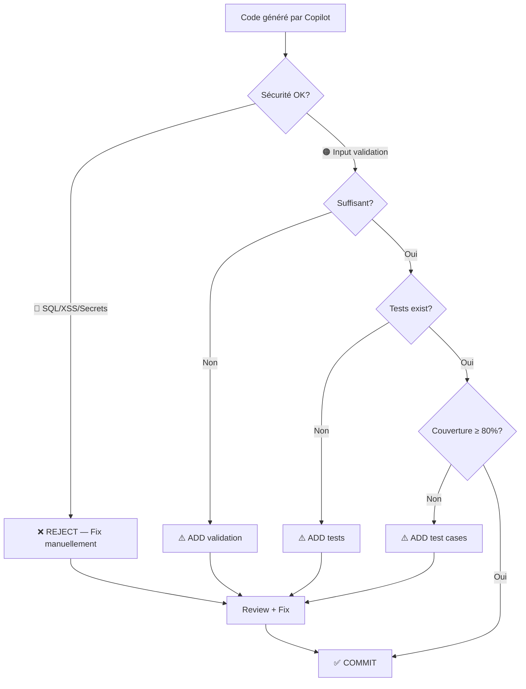

# Sécurité & Qualité du Code Généré

<span class="badge-intermediate">Intermédiaire</span>

## Principe Fondamental : Validation est Votre Responsabilité

GitHub Copilot est entraîné sur des milliards de lignes de code public — code de qualité variable. **Vous êtes responsable de tout ce que vous committez**, qu'il soit généré par Copilot ou écrit manuellement.

**Règle d'or** : Pas de code généré n'entre en production sans review sécurité + tests.

---

## Checklist Rapide

| Élément | Check | Impact |
|---------|-------|--------|
| **SQL** | Paramètres préparés (jamais concaténation) | 🔴 CRITIQUE |
| **Input Validation** | Toutes les entrées user validées avant use | 🔴 CRITIQUE |
| **Secrets** | Jamais de clés hardcodées (env vars only) | 🔴 CRITIQUE |
| **XSS** | HTML/URLs échappés | 🔴 CRITIQUE |
| **Dependencies** | Aucune dépendance inconnue ajoutée | 🟠 IMPORTANT |
| **Error Handling** | Try-catch/error middleware utilisés | 🟠 IMPORTANT |
| **Logging** | Pas de données sensibles en logs | 🟠 IMPORTANT |
| **Tests** | Coverage ≥ 80% des paths | 🟡 MOYEN |
| **Types** | Pas d'`any`, tous paramètres typés | 🟡 MOYEN |

---

## Vulnérabilités Communes Générées par Copilot

### 1. 🔴 Injection SQL

```python
# ❌ Code dangereux que Copilot peut parfois générer
def get_user(username: str):
    query = f"SELECT * FROM users WHERE username = '{username}'"
    return db.execute(query)  # Injection SQL possible !

# ✅ Correct — paramètres préparés
def get_user(username: str):
    query = "SELECT * FROM users WHERE username = ?"
    return db.execute(query, (username,))
```

**Signal d'alarme** : Concaténation de chaîne dans du SQL = 🚨 STOP

---

### 2. 🔴 Secrets Hardcodés

```javascript
// ❌ Copilot peut compléter avec des valeurs d'exemple ressemblant à de vrais secrets
const config = {
    apiKey: "sk-1234567890abcdef",
    dbPassword: "password123",
    jwtSecret: "mysecretkey"
};

// ✅ Toujours utiliser des variables d'environnement
const config = {
    apiKey: process.env.API_KEY ?? (() => { throw new Error('Missing API_KEY') })(),
    dbPassword: process.env.DB_PASSWORD ?? (() => { throw new Error('Missing DB_PASSWORD') })(),
    jwtSecret: process.env.JWT_SECRET ?? (() => { throw new Error('Missing JWT_SECRET') })()
};
```

**Stratégie** : 
- Déjà hardcodé? `git rm --cached` + add `.gitignore`
- Utiliser `git-secrets` ou `detect-secrets` en pre-commit

---

### 3. 🔴 Validation Insuffisante des Entrées

```typescript
// ❌ Copilot génère parfois sans validation
app.post('/users', (req, res) => {
    const user = req.body;  // Données non validées
    db.users.create(user);  // DANGER
    res.json(user);
});

// ✅ Validation avec Zod/Joi
import { z } from 'zod';

const createUserSchema = z.object({
    email: z.string().email('Invalid email'),
    name: z.string().min(2, 'Name required'),
    age: z.number().int().min(18, 'Must be 18+')
});

app.post('/users', (req, res) => {
    try {
        const validatedData = createUserSchema.parse(req.body);
        db.users.create(validatedData);
        res.json(validatedData);
    } catch (error) {
        res.status(400).json({ error: 'Validation failed' });
    }
});
```

---

### 4. 🟠 Cross-Site Scripting (XSS)

```html
<!-- ❌ Copilot peut générer sans échappement -->
<div>{{ userInput }}</div>

<!-- ✅ Échappement correct selon framework -->
<!-- React -->
<div>{userInput}</div>

<!-- Angular -->
<div>{{ userInput }}</div>

<!-- Vue -->
<div>{{ userInput }}</div>

<!-- Plain HTML (JAMAIS faire ça) -->
<div id="content"></div>
<script>
  document.getElementById('content').textContent = userInput;  // ✅ textContent, pas innerHTML
</script>
```

---

### 5. 🟠 Exposition de Données Sensibles en Logs

```python
# ❌ Copilot peut logger des données sensibles
def authenticate(username: str, password: str):
    logger.info(f"User {username} attempted login with password {password}")  # 🚨
    # ...

# ✅ Logger seulement ce qui est nécessaire
def authenticate(username: str, password: str):
    logger.info(f"Authentication attempt for user {username}")  # ✅
    if not verify_password(password, stored_hash):
        logger.warning(f"Failed authentication for {username}")
    # Jamais log le password lui-même
```

---

## Patterns de Validation Recommandés

### Zod (TypeScript)
```typescript
import { z } from 'zod';

const UserSchema = z.object({
  email: z.string().email(),
  age: z.number().int().min(0).max(150),
  role: z.enum(['USER', 'ADMIN']).default('USER')
});

type User = z.infer<typeof UserSchema>;  // Type déduit automatiquement
const user = UserSchema.parse(rawData);
```

### Pydantic (Python)
```python
from pydantic import BaseModel, EmailStr, validator

class User(BaseModel):
    email: EmailStr
    age: int
    role: str = 'USER'
    
    @validator('age')
    def age_must_be_valid(cls, v):
        if not 0 <= v <= 150:
            raise ValueError('Age must be between 0 and 150')
        return v
```

---

## Review Copilot : Checklist Avant Commit



---

## Outils de Vérification Automatique

| Outil | Use Case | Integration |
|-------|----------|-------------|
| **SonarQube** | Qualité code + sécurité | CI/CD |
| **git-secrets** | Détecter secrets en post-commit | Git hooks |
| **Snyk** | Vulnérabilités dépendances | CI/CD |
| **ESLint/Pylint** | Lint security rules | Pre-commit |
| **OWASP ZAP** | Vuln scan API | CI/CD |

---

## Ressources

- [Best Practices](utilisation-effective.md)
- [Organisation Code](organisation-code.md)
- [Chapitre Installation](../chapitre-1-installation/index.md)
    await createUser(user);
    res.json(user);
});

// ✅ Avec validation des entrées
import { z } from 'zod';

const CreateUserSchema = z.object({
    email: z.string().email(),
    name: z.string().min(2).max(100),
    role: z.enum(['USER', 'ADMIN'])
});

app.post('/users', (req, res) => {
    const validated = CreateUserSchema.parse(req.body);  // Lance une erreur si invalide
    await createUser(validated);
    res.json(validated);
});
```

### 4. Cryptographie faible

```java
// ❌ Copilot peut suggérer des algorithmes dépréciés
MessageDigest md = MessageDigest.getInstance("MD5");  // MD5 est cassé
byte[] hash = md.digest(password.getBytes());

// ✅ Utiliser des algorithmes récents
// Pour les mots de passe, utilisez BCrypt, Argon2, ou PBKDF2
BCryptPasswordEncoder encoder = new BCryptPasswordEncoder(12);
String hashedPassword = encoder.encode(password);
```

---

## Problèmes de licence et droits d'auteur

### Le risque

Copilot est entraîné sur du code public, dont certains sont sous licence restrictive (GPL, AGPL, etc.). Des suggestions peuvent par inadvertance reproduire du code protégé.

### Mesures de protection

**1. Activer le filtrage de code dupliqué** dans les paramètres GitHub Copilot :

Sur [github.com/settings/copilot](https://github.com/settings/copilot) :
- Activez **"Block suggestions matching public code"** (Duplication Detection)

**2. Revue des séquences de code inhabituelles**

Si Copilot génère un algorithme très spécifique (tri, parsing complexe) qui semble trop parfait, vérifiez sa provenance potentielle.

**3. Pour les projets commerciaux**

Utilisez GitHub Copilot Business ou Enterprise qui incluent un engagement plus fort sur les protections IP via les politiques de GitHub.

---

## Tests : obligation non négociable

Tout code généré par Copilot **doit être testé**. Copilot peut générer du code qui compile et s'exécute mais qui produit des résultats incorrects dans certains cas.

### Stratégie de test minimal

```
Nouveau code généré par Copilot
    │
    ├── Test happy path (cas nominal)
    ├── Test edge cases (null, vide, limites)
    ├── Test error cases (exceptions attendues)
    └── Test intégration si dépendances externes
```

### Utiliser Copilot pour générer les tests

Ironiquement, Copilot est excellent pour générer les tests du code qu'il vient de créer :

```
Sur VS Code avec Inline Chat (++ctrl+i++) :
"Génère les tests unitaires Jest pour cette fonction.
Couvre : happy path, cas null, cas array vide, et les exceptions."
```

---

## Revue de code systématique

### Pour vous-même

Avant de committer du code avec des parties générées par Copilot :

1. **Lisez le diff entier** — pas seulement les parties que vous avez écrites manuellement
2. **Testez localement** — ne committez jamais de code non testé, même si c'est "juste du boilerplate"
3. **Cherchez les TODO/FIXME** générés — Copilot en crée parfois sans que vous les demandiez

### En équipe (Pull Request)

Signalez dans votre PR quelles parties ont été générées par IA si votre équipe a une politique là-dessus. De nombreuses équipes intègrent un point de revue spécifique pour le code IA.

---

## Désactiver Copilot pour les fichiers sensibles

Via `.vscode/settings.json` ou `.copilotignore` :

```json
// .vscode/settings.json
{
    "github.copilot.enable": {
        "*": true,
        "dotenv": false,          // .env files
        "properties": false,      // .properties files (Java)
        "yaml": false             // Si vos YAML contiennent des secrets
    }
}
```

!!! info "Syntaxe `.copilotignore`"
    Ce fichier utilise exactement la même syntaxe que `.gitignore` — motifs glob, wildcards `*` et `**`, chemins relatifs depuis la racine du dépôt. Il est lu par Copilot mais **ignoré par Git**.

```gitignore
# .copilotignore
.env
.env.*
*secrets*
*credentials*
config/production.yaml
infrastructure/terraform/
```

---

## Les 3 règles à ne jamais oublier

!!! danger "Règles d'or"
    1. **Validez toujours** — Copilot peut produire du code fonctionnel mais incorrect ou non sécurisé
    2. **Zéro secret hardcodé** — Clés API, mots de passe et tokens : toujours en variables d'environnement
    3. **Testez avant de committer** — Même le boilerplate généré doit passer par des tests

---

## Prochaines étapes

- [Performance & Ressources](performance.md) — Optimiser Copilot pour ne pas impacter l'IDE
- [Troubleshooting](../chapitre-5-troubleshooting/index.md) — Résoudre les problèmes courants
