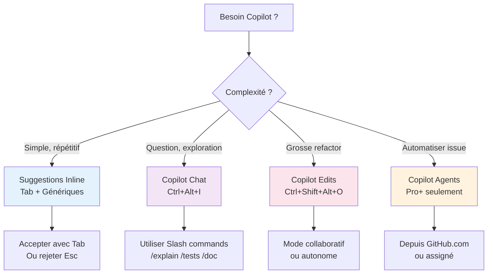
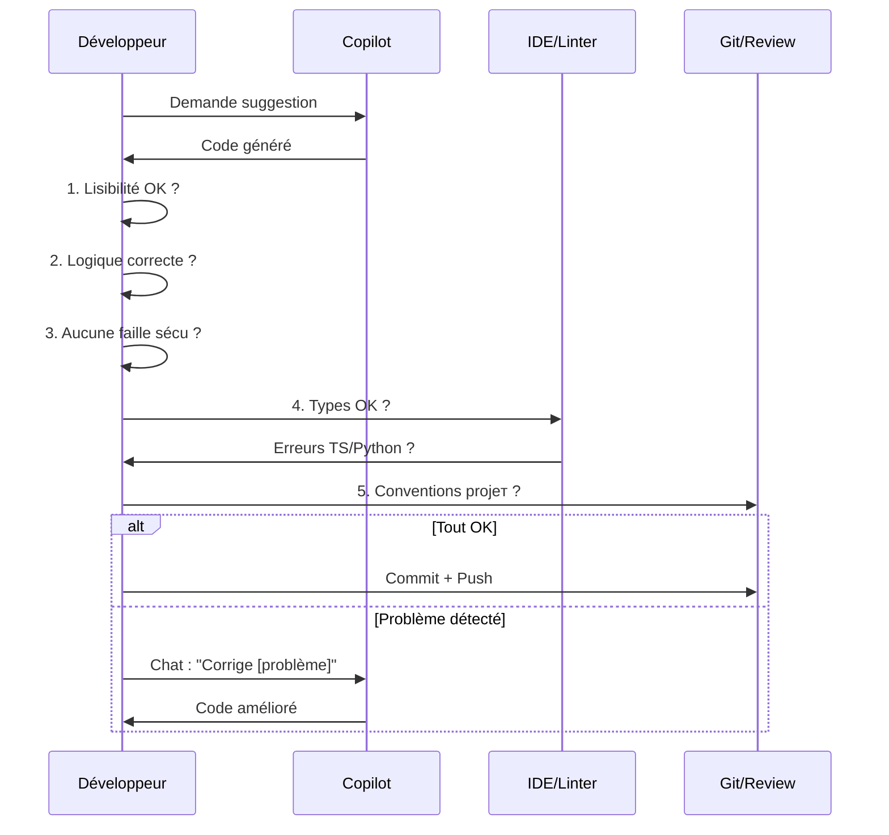

# Utilisation Effective de GitHub Copilot

<span class="badge-intermediate">Intermédiaire</span>

## Guide Décisionnel : Quand utiliser quoi ?

Avant de commencer, choisissez le bon outil pour votre tâche :



---

## Écrire des prompts efficaces (commentaires)

La façon la plus efficace de guider Copilot pour les suggestions inline est d'écrire des **commentaires précis** avant votre code.

### La technique du commentaire-prompt

```python
# ❌ Trop vague — Copilot génère quelque chose de générique
# Fonction pour les utilisateurs

# ✅ Précis et contextualisé — Copilot génère quelque chose d'utile
# Filtre les utilisateurs actifs (status='active') créés dans les 30 derniers jours
# Retourne une liste triée par date de création décroissante
# Paramètre: users (List[User]) — liste complète des utilisateurs
def get_recent_active_users(users: list[User]) -> list[User]:
```

### Niveau de détail recommandé

| Niveau | Quand l'utiliser | Exemple |
|--------|-----------------|---------|
| **Minimal** | Code très simple et évident | `# Validation de l'email` |
| **Modéré** | Code avec logique spécifique | `# Validate email format with regex, return bool` |
| **Détaillé** | Code complexe ou non-standard | Décrivez inputs, outputs, edge cases, algo attendu |
| **Préconditions** | Fonctions critiques | Listez les hypothèses (`# Assume user.id is always a valid UUID`) |

---

## Techniques avancées de prompting inline

### 1. Décrire l'algorithme attendu

```typescript
// Algorithme de Dijkstra pour trouver le chemin le plus court
// entre deux noeuds dans un graphe orienté pondéré
// Complexité : O((V + E) log V) avec min-heap
// Retourne le tableau des noeuds du chemin + le coût total
function dijkstra(graph: Graph, start: string, end: string): PathResult {
```

### 2. Donner des exemples d'entrée/sortie

```javascript
// Convertit un objet imbriqué en QueryString URL
// Ex: {user: {name: "Alice", age: 30}, active: true}
// →   "user[name]=Alice&user[age]=30&active=true"
function toQueryString(obj, prefix = '') {
```

### 3. Spécifier les contraintes de performance

```java
// Recherche binaire dans un tableau trié d'entiers
// O(log n) — NE PAS utiliser de recherche linéaire
// Retourne l'index ou -1 si absent
// Tableau garanti trié en ordre croissant sans doublons
public int binarySearch(int[] sortedArray, int target) {
```

### 4. Références à du code existant

```typescript
// Même pattern que UserRepository.findByEmail()
// mais pour la recherche par phone number
// Utiliser la même gestion d'erreurs (UserNotFoundException)
async findByPhoneNumber(phone: string): Promise<User> {
```

---

## Copilot Chat : meilleures pratiques de prompting

### Commencer par un mini-PRD

Avant de demander du code, formalisez un mini-PRD en 5 points :

1. Objectif produit
2. Utilisateurs concernés
3. Contraintes techniques
4. Critères d'acceptation
5. Cas limites

Template rapide :

```markdown
## PRD court
- Objectif: ...
- Utilisateurs: ...
- Contraintes: ...
- Acceptance criteria:
   - [ ] ...
   - [ ] ...
- Cas limites:
   - ...
```

Puis demandez à Copilot de proposer le plan d'implémentation avant d'écrire le code.

### Structurer les demandes complexes

```
❌ "Fais un CRUD pour les utilisateurs"

✅ "Crée une API REST CRUD pour les utilisateurs avec :
   - Express + TypeScript
   - Validation avec Zod (schema User : id UUID, email, name, role: ADMIN|USER)
   - Gestion d'erreurs avec mes classes custom dans src/errors/
   - Tests Jest (happy path + erreurs)
   - Pas de `any`, TypeScript strict
   Suis les patterns de src/controllers/ProductController.ts"
```

### Itération efficace

```
Tour 1 → "Génère le service UserService avec les 5 méthodes CRUD"
Tour 2 → "Ajoute la validation métier : email unique, role ne peut pas être 
          modifié par l'utilisateur lui-même"
Tour 3 → "Ajoute des tests pour les cas d'erreur"
Tour 4 → "Refactorise pour extraire la logique de validation dans 
          un validateur séparé"
```

### Utiliser les variables de contexte dans Chat

Dans Copilot Chat, vous pouvez référencer :
- `#file` — inclure un fichier spécifique comme contexte
- `#selection` — le code sélectionné dans l'éditeur
- `@workspace` — rechercher dans tout le workspace
- `@vscode` — poser des questions sur VS Code lui-même

---

## Quand accepter une suggestion

### Checklist avant d'accepter

- [ ] **Logique correcte** : La suggestion fait exactement ce que vous vouliez ?
- [ ] **Nommage cohérent** : Les noms respectent les conventions du projet ?
- [ ] **Pas d'effets de bord** : La fonction ne modifie pas d'état global inattendu ?
- [ ] **Gestion des erreurs** : Les cas d'erreur sont traités ?
- [ ] **Imports** : Les imports nécessaires sont inclus ou à ajouter ?
- [ ] **Pas de secrets** : Aucune valeur hardcodée qui devrait être une variable ?

### Quand accepter sans hésiter

- Code utilitaire simple (formatage de dates, utilitaires de chaînes)
- Boilerplate standard du langage/framework (getters/setters, constructeurs)
- Code que vous connaissez bien et pouvez vérifier rapidement
- Suggestions courtes (1-3 lignes) où le problème est évident

### Quand vérifier attentivement

- Logique métier complexe
- Code de sécurité (auth, crypto, validation d'entrées)
- Requêtes SQL ou accès base de données
- Algorithmes complexes (tri, graphe, cryptographie)
- Gestion de concurrence / async

### Quand rejeter (++escape++)

- La suggestion ne correspond pas à l'intention
- Le code semble "plausible" mais incorrect logiquement
- Utilisation d'API dépréciées ou incorrectes pour votre version
- Duplication de code déjà existant dans le projet

---

## Itération et raffinement

### Technique 1 : Acceptation partielle

Au lieu d'accepter toute une suggestion, acceptez **mot par mot** avec ++ctrl+right++ (++option+right++ sur macOS). Cela vous permet de garder le début d'une suggestion et de modifier la fin.

### Technique 2 : Suggestions alternatives

Si la première suggestion ne convient pas :
- Appuyez sur ++alt+bracket-right++ pour voir la suggestion suivante
- Il peut y avoir jusqu'à 10 alternatives — explorez-les avant de rejeter

### Technique 3 : Correction et re-suggestion

1. Acceptez une suggestion imparfaite
2. Corrigez manuellement la partie incorrecte
3. Positionnez le curseur à la fin de votre correction
4. Copilot va générer une nouvelle suggestion cohérente avec votre correction

### Technique 4 : Partial completion + Chat

1. Acceptez le début d'une fonction générée par Copilot
2. Ouvrez Copilot Chat (++ctrl+i++) sur le code incomplet
3. Demandez : "*Complète cette fonction en ajoutant la gestion de [cas spécifique]*"

---

## Valider le Code Généré

**Principe clé** : Vous êtes **toujours responsable** du code que vous committez. Copilot est un assistant, pas un garant de qualité.

### Flow de Validation



### Checklist de Validation

Avant d'accepter une suggestion, demandez-vous :

| Aspect | Question | Action si ❌ |
|--------|----------|------------|
| **Lisibilité** | Je comprends ce que ce code fait ? | Rejeter, demander à Copilot Chat |
| **Logique** | La logique répond exactement ma demande ? | Corriger manuellement ou utiliser Edits |
| **Sécurité** | Pas d'injection SQL, XSS, ou secrets ? | Rejeter immédiatement |
| **Types** | Types corrects pour mon contexte ? | Laisser IDE proposer fixes |
| **Perfs** | Pas de boucles infinies ou N+1 queries ? | Revoir algorithme |
| **Tests** | Ce code a besoin de tests ? | Générer avec Copilot `/tests` |
| **Conventions** | Respecte le style du projet ? | Utiliser formatters (Prettier, Black) |

!!! danger "Sécurité — Points d'attention"
    - ❌ **Jamais** accepter un code avec secrets/API keys en dur
    - ❌ **Jamais** faire confiance à des requêtes SQL construites par string concat
    - ❌ **Toujours** valider les inputs utilisateur avant utilisation
    - ❌ **Toujours** utiliser parameterized queries/prepared statements
    - ✅ **Utiliser** git hooks (pre-commit) pour bloquer les secrets

---

## Copilot dans le workflow Git

### Messages de commit avec Copilot

Dans VS Code Source Control :
1. Cliquez sur l'icône ✨ dans le champ de message de commit
2. Copilot analyse vos changements et génère un message descriptif
3. Modifiez si nécessaire avant de committer

### Revue de code avec Copilot Chat

Avant de pousser un PR :
```
@workspace Fais une revue de code des fichiers que j'ai modifiés. 
Cherche les bugs potentiels, les problèmes de sécurité et les 
violations de nos conventions (voir .github/copilot-instructions.md)
```

### Génération de description de PR

```
J'ai modifié les fichiers [liste]. Génère une description de Pull Request 
incluant : quoi a changé, pourquoi, comment tester ces changements, 
et les risques potentiels.
```

---

## En résumé

- **Commentaire = prompt** : plus votre commentaire est précis, meilleure est la suggestion
- **Le mini-PRD** avant une demande complexe améliore nettement la qualité du code généré
- **Acceptez de manière sélective** : mot par mot (++ctrl+right++) pour garder le contrôle
- **Explorez les alternatives** avec ++alt+bracket-right++ avant de rejeter une suggestion
- **Copilot Chat + `@workspace`** pour les tâches multi-fichiers complexes

---

## Prochaines étapes

- [Organisation du code](organisation-code.md) — Structurer le code pour de meilleures suggestions
- [Productivité](productivite.md) — Raccourcis et workflows optimisés
