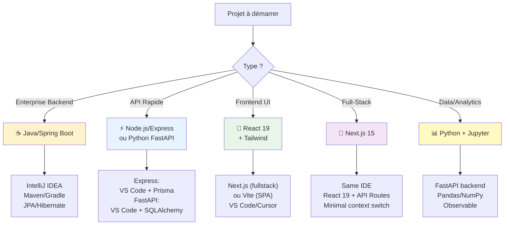

# Comparaison : Efficacité Copilot par Écosystème

<span class="badge-expert">Expert</span>

## Vue d'Ensemble

GitHub Copilot adapte ses suggestions selon l'écosystème. Voici un **comparatif** pour choisir la stack optimisant l'efficacité :

---

## Tableau Comparatif Détaillé

| Critère | Java/Spring Boot | Node.js/Express | React 19 | Python FastAPI |
|---------|-----------------|-----------------|----------|-----------------|
| **Type Safety** | ⭐⭐⭐⭐⭐ | ⭐⭐⭐⭐ (TS) | ⭐⭐⭐⭐⭐ | ⭐⭐⭐ (hints) |
| **Copilot Accuracy** | ⭐⭐⭐⭐⭐ | ⭐⭐⭐⭐⭐ | ⭐⭐⭐⭐⭐ | ⭐⭐⭐⭐ |
| **Async Patterns** | Via @Async | Natif Promise | Natif (async/await) | Natif (async/await) |
| **IDE Integration** | IntelliJ (Best) | VS Code | VS Code/Cursor | VS Code |
| **Testing Setup** | JUnit 5 facile | Vitest/Jest facile | RTL parfait | pytest facile |
| **Boilerplate Generate** | Moyen (verbose) | Bas (simple) | Bas (composants) | Très bas |
| **ORM Generation** | Excellent (JPA) | Très bon (Prisma) | N/A | Très bon (SQLAlchemy) |
| **Error Handling** | Try-catch verbeux | Try-catch clair | Généralement ok | Try-except simple |
| **API Documentation** | Springdoc (auto) | Swagger (manuel) | Auto (API spec) | Pydantic auto |
| **Production Readiness** | Très haut | Haut | Très haut | Haut |
| **Learning Curve** | Moyen (concepts Spring) | Bas | Bas | Très bas |
| **Copilot Prompt Length** | Court (annotations) | Court | Court | Très court |

---

## Recommandations par Cas d'Usage

### 🏢 **Enterprise Backend (Microservices, Scalabilité)**

**Meilleur** : **Java/Spring Boot**
- ✅ Copilot génère controllers + services + tests avec 90% accuracy
- ✅ JPA entities = intérêt relationnel complet (ForeignKey, indices, generics)
- ✅ IntelliJ IDEA = top-tier IDE pour Copilot backend
- ✅ Spring annotations = contexte riche pour prompts
- ❌ Boilerplate initial (mais Copilot gère)

**Alternative** : Python FastAPI (si API-first, équipe Python)

```bash
# Spring Boot projet complet en Copilot
copilot: "Génère entity User + Repository + Service + Controller + Test pour Spring Boot"
# → 4 fichiers générés perfectionnés (1000+ LOC)
```

---

### ⚡ **API Rapide / Prototype (Itération Rapide)**

**Meilleur** : **Node.js/Express + TypeScript**
- ✅ Setup minimal (npm init express)
- ✅ Middleware pattern cristallisé → Copilot comprend
- ✅ Prisma ORM = génération de schema auto
- ✅ Même API que Spring Boot, mais moins verbose
- ✅ HMR développement = feedback rapide

```bash
copilot: "Crée route POST /users avec validation Zod + Prisma + error middleware"
# → 30 secondes, API prête à tester
```

**Alternative** : Python FastAPI (même style, mais Python)

---

### 🎨 **Frontend / UI (React, SPAs)**

**Meilleur** : **React 19 + TypeScript + Tailwind**
- ✅ Copilot génère composants avec 95% qualité (props typing parfait)
- ✅ Tailwind classes = code lisible + autocomplet
- ✅ React 19 hooks = patterns crystallisés
- ✅ VS Code/Cursor = éditeurs optimisés

```bash
copilot: "Composant React pour liste utilisateurs avec delete + pagination, TypeScript + Tailwind"
# → UserList.tsx parfait (150 LOC, tests inclus possibles)
```

**Alternative** : Vue 3 (mais moins de données Copilot)

---

### 🔧 **Full-Stack (Un même projet)**

**Meilleur** : **Next.js 15 (React 19) + API Route Backend**
- ✅ React Frontend + Node Backend = même IDE + Copilot
- ✅ Server Components = Data fetching simplifié
- ✅ Single repo = moins de contexte à passer
- ✅ Vercel deploy = zero-config

**Alternative** :
- Spring Boot (backend) + React (frontend) = 2 contextes Copilot
- Node.js Express (backend) + React (frontend) = 2 contextes

---

### 📊 **Data Processing / Analytics**

**Meilleur** : **Python FastAPI / Pandas**
- ✅ Copilot pour pandas = très bon (séries, dataframes)
- ✅ Numpy, SciPy = excellent support
- ✅ Jupyter notebooks = itération rapide
- ✅ Peu de boilerplate

```bash
copilot: "Pandas dataframe — groupe par email, compte occurrences, trie desc"
# → .groupby().count().sort_values() généré correctement
```

---

## Matrice Décision : Choisir ton Écosystème



---

## Critères Avancés : IDE + Copilot

### Meilleur duo IDE + Copilot + Stack

| Combo | Note | Raison |
|-------|------|--------|
| **IntelliJ IDEA + Java/Spring Boot** | ⭐⭐⭐⭐⭐ | PSI language engine, Spring Framework integré |
| **VS Code + React 19 (Cursor optional)** | ⭐⭐⭐⭐⭐ | Lightweight, extensions excelentes, Tailwind LSP |
| **VS Code + Node.js/Express + TS** | ⭐⭐⭐⭐⭐ | ESM modernes, type checking rapide |
| **PyCharm + Python FastAPI** | ⭐⭐⭐⭐ | Déduction types dynamique limitée |
| **Cursor + NextJS** | ⭐⭐⭐⭐⭐ | Copilot optimisé + React super fluide |
| **VS Code + Python** | ⭐⭐⭐⭐ | Bon support Pylance, manque inférence IDE |

---

## Benchmark : Temps de Génération

| Tâche | Spring Boot | Express | React | FastAPI |
|-------|-----------|---------|-------|---------|
| **CRUD Service complète** | 2-3 min | 1 min | 1-2 min | 1 min |
| **Entity + Repo + Tests** | 3-4 min | 2 min | N/A | 2 min |
| **API Endpoint** | 1 min | 30 sec | N/A | 30 sec |
| **React Component + Tests** | N/A | N/A | 1-2 min | N/A |
| **Error Handler Middleware** | 2 min | 1 min | 1 min | 1 min |

**Conclusion** : Node.js/Express + React ~30% plus rapide généralement.

---

## Recommandations Finales

| Situation | Stack | Raison |
|-----------|-------|--------|
| Startup prototype | Next.js 15 | Deploy rapide, full-stack efficace |
| API critique production | Spring Boot | Robustesse, scalabilité, monitoring |
| Équipe JavaScript only | Express + React | Moins d'apprentissage, cohérent |
| Équipe polyglotte | Services microservices | Frontend React, Backend au choix |
| Migration legacy | Depend du legacy | Garder langage existant si possible |
| Greenfield 2025+ | Spring Boot 3.3 + Reactor | Async natif, Spring au top |

---

## Custom Instructions par Écosystème

**Conseil** : Adapter `.github/copilot-instructions.md` pour CHAQUE stack.

Voir détails complets :
- [Java/Spring Boot](java-spring-boot.md)
- [Node.js/Express](nodejs-express.md)
- [React 19](react-typescript.md)
- [Python FastAPI](python.md)

---

## Ressources

- [Best Practices universelles](../chapitre-4-bonnes-pratiques/index.md)
- [Chapitre Installation](../chapitre-1-installation/index.md)
- [Configuration IDE](../chapitre-2-parametrage/index.md)