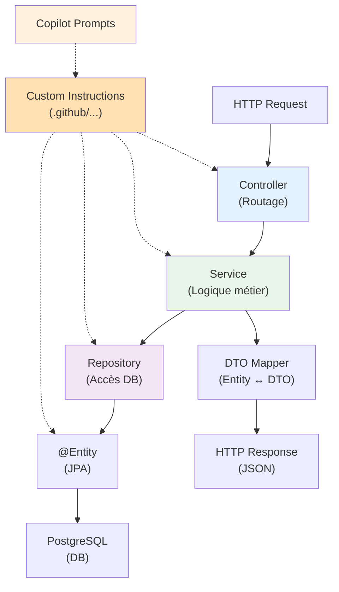

# :simple-java: Cas d'Usage — Java & Spring Boot avec GitHub Copilot

<span class="badge-expert">Expert</span>

## Stack Recommandé

Optimiser Copilot pour l'écosystème Java/Spring nécessite la bonne configuration :

| Composant | Version | Raison |
|-----------|---------|--------|
| **IDE** | IntelliJ IDEA 2024.1+ | PSI natif, Spring analysé en profondeur |
| **JDK** | 21 LTS | Modern features, records, pattern matching |
| **Spring Boot** | 3.2+ | Dernières optimisations, security features |
| **Build Tool** | Maven 3.9+ ou Gradle 8+ | Dependency management fluide |
| **Test Framework** | JUnit 5 + Mockito | Modèle assertion fluent |
| **Logging** | SLF4J + Logback | Configuré par défaut dans Spring |

---

## Configurer Copilot pour Spring Boot

### Custom Instructions (`.github/copilot-instructions.md`)

```markdown
# GitHub Copilot — Spring Boot Project

Stack: Java 21, Spring Boot 3.2, PostgreSQL 15, Maven 3.9, JUnit 5

Architecture (DDD-inspired):
- Layers: api → service → repository → domain
- Controllers: HTTP handlers only (~20 lines max)
- Services: business logic + orchestration
- Repositories: Data access via Spring Data JPA
- Entities: @Entity classes with @Id primary key
- DTOs: for API input/output (request/response)

Conventions:
- Naming: Service suffixes with "Service", Repository with "Repository"
- Composition: Use @Autowired constructor injection (not field)
- Mapping: ModelMapper or MapStruct for Entity ↔ DTO
- Exceptions: Custom @ControllerAdvice for global error handling
- Logging: Use org.slf4j.Logger with slf4j annotation

Database:
- Migrations: Flyway (V001__description.sql pattern)
- Constraints: FK/PK/Unique at DB level + @Unique annotation in entity
- Soft deletes: Use @Where(clause = "deleted_at IS NULL") or @SQLDelete

Testing:
- Unit tests: Services with @ExtendWith(MockitoExtension.class)
- Integration tests: @SpringBootTest + Testcontainers for DB
- Coverage: Minimum 80% — use JaCoCo maven plugin

Security:
- Authentication: OAuth2 or JWT via Spring Security
- Authorization: @PreAuthorize with role-based checks
- No hardcoded secrets — use environment variables or Spring Vault

API standards:
- RESTful: GET/POST/PUT/DELETE with proper status codes
- Pagination: Implement Page<T> from Spring Data
- Versioning: /api/v1/ endpoint prefix
- Docs: Springdoc OpenAPI 2.0 (Swagger)
```

### Activation IntelliJ

1. Créez/modifiez `.github/copilot-instructions.md` à la racine du projet
2. IntelliJ **lit automatiquement** ce fichier
3. Copilot respecte ces contraintes dans toutes les suggestions

---

## Patterns Spring Boot Optimisés pour Copilot

### 1. Service Class Pattern

**Approche efficace** : Prompts par couche

```java
// UserService.java — Écrire le commentaire AVANT la logique

import org.springframework.stereotype.Service;
import org.springframework.transaction.annotation.Transactional;
import org.slf4j.Logger;
import org.slf4j.LoggerFactory;

@Service
public class UserService {
    private static final Logger log = LoggerFactory.getLogger(UserService.class);
    private final UserRepository userRepository;
    private final UserMapper userMapper;
    
    // Injection par constructeur
    public UserService(UserRepository userRepository, UserMapper userMapper) {
        this.userRepository = userRepository;
        this.userMapper = userMapper;
    }
    
    // Prompt par commentaire détaillé
    /**
     * Crée un nouvel utilisateur avec validation d'unicité d'email.
     * Envoie un email de confirmation (async).
     * @throws UserAlreadyExistsException si email déjà enregistré
     * @param createUserDto contient email, password, name
     * @return l'utilisateur créé avec rôle USER par défaut
     */
    @Transactional
    public UserDto createUser(CreateUserDto createUserDto) {
        // Vérifier email unique (contrainte DB + appli)
        if (userRepository.existsByEmail(createUserDto.getEmail())) {
            throw new UserAlreadyExistsException("Email already in use");
        }
        
        // Mapper DTO → Entity + mettre default role
        User user = userMapper.toEntity(createUserDto);
        user.setRole(Role.USER);
        user.setActive(true);
        
        // Persister + log
        User savedUser = userRepository.save(user);
        log.info("User created: id={}, email={}", savedUser.getId(), savedUser.getEmail());
        
        // Mapper Entity → DTO pour réponse
        return userMapper.toDto(savedUser);
    }
}
```

**Copilot génère** : implémentation logique complète avec gestion d'erreurs

### 2. Repository Pattern

```java
// UserRepository.java
import org.springframework.data.jpa.repository.JpaRepository;
import org.springframework.data.jpa.repository.Query;
import org.springframework.stereotype.Repository;

@Repository
public interface UserRepository extends JpaRepository<User, UUID> {
    // Finder methods — Copilot suggère automatiquement
    boolean existsByEmail(String email);
    Optional<User> findByEmail(String email);
    List<User> findByRoleAndActiveTrue(Role role);
    
    // Custom queries — Préciser l'intention
    @Query("""
        SELECT u FROM User u 
        WHERE u.active = true 
        AND u.createdAt >= :startDate 
        ORDER BY u.createdAt DESC
        """)
    Page<User> findActiveUsersCreatedAfter(LocalDateTime startDate, Pageable pageable);
}
```

### 3. Entity avec Annotations

```java
// User.java — Entité JPA bien annotée
import jakarta.persistence.*;
import org.hibernate.annotations.CreationTimestamp;
import org.hibernate.annotations.UpdateTimestamp;
import lombok.*;

@Entity
@Table(name = "users", uniqueConstraints = @UniqueConstraint(columnNames = "email"))
@Data
@NoArgsConstructor
@AllArgsConstructor
@Builder
public class User {
    @Id
    @GeneratedValue(strategy = GenerationType.UUID)
    private UUID id;
    
    @Column(nullable = false, unique = true)
    private String email;
    
    @Enumerated(EnumType.STRING)
    private Role role;
    
    @Column(nullable = false)
    private boolean active;
    
    @CreationTimestamp
    @Column(updatable = false)
    private LocalDateTime createdAt;
    
    @UpdateTimestamp
    private LocalDateTime updatedAt;
}
```

---

## Génération de Tests avec Copilot

Pour auto-générer des tests de qualité :

### Prompt Chat Efficace

```
@workspace Génère des tests unitaires complètement pour UserService.createUser()

Utilise :
- JUnit 5 avec @ExtendWith(MockitoExtension.class)
- Mockito pour UserRepository et UserMapper
- Given-When-Then structure
- Cas de test : happy path, email déjà existant, mappage DTO

Inclus assertions fluent (Assertions.assertThat(), not assertEquals)
```

**Copilot génère** :
```java
@ExtendWith(MockitoExtension.class)
class UserServiceTest {
    @Mock
    private UserRepository userRepository;
    @Mock
    private UserMapper userMapper;
    @InjectMocks
    private UserService userService;
    
    @Test
    void testCreateUserSuccess() {
        // Given
        CreateUserDto dto = new CreateUserDto("john@example.com", "password", "John");
        User user = new User(UUID.randomUUID(), "john@example.com", Role.USER, true, ...);
        UserDto expectedDto = new UserDto(user.getId(), "john@example.com", Role.USER);
        
        given(userRepository.existsByEmail("john@example.com")).willReturn(false);
        given(userMapper.toEntity(dto)).willReturn(user);
        given(userRepository.save(user)).willReturn(user);
        given(userMapper.toDto(user)).willReturn(expectedDto);
        
        // When
        UserDto result = userService.createUser(dto);
        
        // Then
        assertThat(result.getEmail()).isEqualTo("john@example.com");
        verify(userRepository).save(user);
    }
}
```

---

## Pièges Courants Java Spring Boot

| Piège | Signe avant-coureur | Solution |
|-------|-------------------|----------|
| **N+1 queries** | 1 requête + N requêtes par entité | Utiliser `@EntityGraph` ou `join fetch` dans @Query |
| **Lazy loading outside TX** | `LazyInitializationException` | Charger collections dans service (TX boundary) |
| **Injection circulaire** | Stack overflow au startup | Refactorer architecture (extracte interface service) |
| **Hardcoded DB/API URLs** | Secret en suggestions | JAMAIS hardcoder — utiliser `@Value("${app.property}")` |
| **Oublier @Transactional** | Changements non sauvegardés | Ajouter @Transactional sur services modifiant DB |
| **Typage faible (Object/Any)** | Warnings IDE massifs | Toujours utiliser generics : `List<User>` pas `List` |

---

## Diagramme : Architecture Spring + Copilot



---

## Ressources & Prochaines Étapes

- [Best Practices](../chapitre-4-bonnes-pratiques/utilisation-effective.md) — Patterns universels
- [Comparaison Ecosystèmes](comparaison-ecosystemes.md) — Spring Boot vs autres stacks
- [IntelliJ Référence](../chapitre-1-installation/intellij/reference.md) — Raccourcis + features