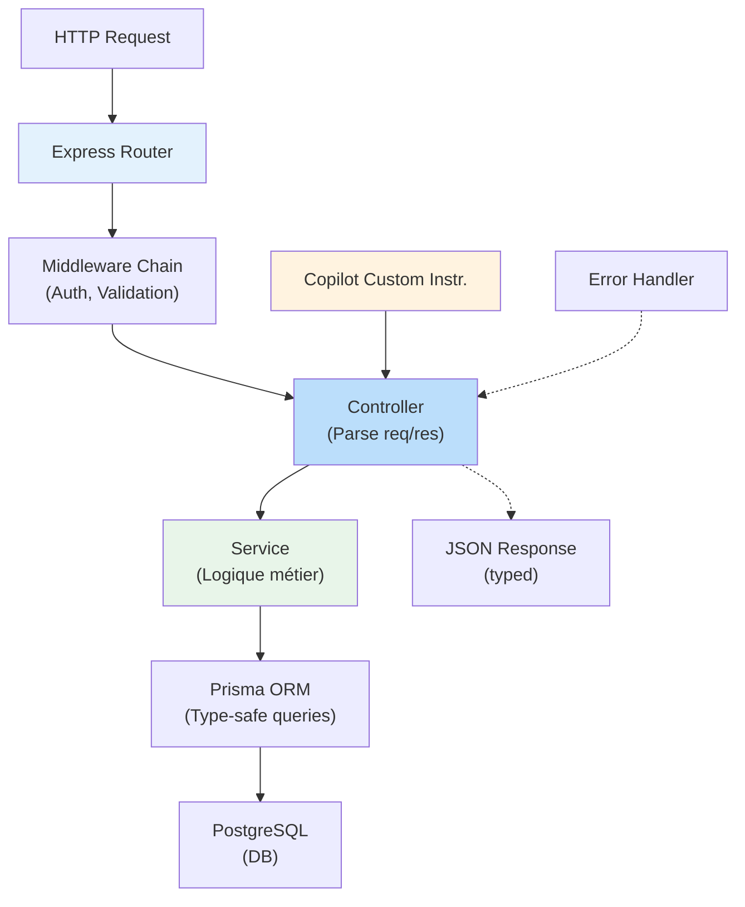

# :simple-nodedotjs: Cas d'Usage — Node.js & Express avec GitHub Copilot

<span class="badge-intermediate">Intermédiaire</span>

## Stack Recommandé

Configuration optimale pour Copilot sur Node.js/Express :

| Composant | Version | Raison |
|-----------|---------|--------|
| **Runtime** | Node.js 20 LTS+ | Stability, V8 récent, modules ESM |
| **Framework** | Express 4.18+ | Middleware patterns stables |
| **Language** | TypeScript 5.x | Inférence type excellente, Copilot-friendly |
| **ORM** | Prisma 5 ou Drizzle | Type-safe query builders |
| **HTTP Client** | Axios ou Fetch API | Bien documenté, pattern standard |
| **Async** | async/await + Express | Étouffer les erreurs avec try-catch |
| **Testing** | Vitest + Supertest | ESM compatible, assertions fluent |

---

## Configurer Copilot pour Express

### Custom Instructions (`.github/copilot-instructions.md`)

```markdown
# GitHub Copilot — Node.js/Express Project

Stack: Node.js 20, Express 4.18, TypeScript 5.x, Prisma 5, PostgreSQL 15

Architecture (Layered):
- Routes: Express routers, max 10 lines per route handler
- Controllers: Request/response handling
- Services: Business logic + validation
- Models/Entities: Prisma @models (auto-generated)
- Middleware: Error handling, auth, logging

Conventions:
- Naming: routes/ folder for Express Router instances
- Controllers: named UserController, handling req/res/next
- Services: named UserService, pure functions where possible
- Error handling: Always use try-catch in async route handlers
- Logging: console.log for development, pino/winston for production

Async patterns:
- Express middleware: async (req, res, next) => { ... } with error boundary
- Never forget .catch() or try-catch
- Use async/await, not .then() chains

TypeScript:
- Strict mode enabled in tsconfig.json
- All function parameters typed (no any)
- Use interfaces for request/response DTOs
- Export types from domain models

Database (Prisma):
- Models in prisma/schema.prisma
- Queries: await prisma.user.findUnique(), prisma.user.create()
- Transactions: await prisma.$transaction([...])
- Always return typed objects (Prisma auto-infers)

API standards:
- RESTful: /api/v1 prefix
- Status codes: 200/201/400/401/404/500
- JSON responses: { data, error, meta }
- Validation: Use Zod or Joi for input schemas

Testing:
- Unit: Vitest + mock services
- Integration: Supertest to test routes + real DB (Testcontainers)
- Coverage: Minimum 80%
```

### Activation VS Code

1. Créez `.github/copilot-instructions.md` à la racine
2. **Redémarrez VS Code** (Cmd+K Cmd+I pour forcer relecture)
3. Les suggestions respecteront ces patterns

---

## Patterns Express Optimisés pour Copilot

### 1. Route + Controller Pattern

**Approche** : Séparation claire des couches

```typescript
// routes/users.router.ts
import { Router, Request, Response, NextFunction } from 'express';
import { UserController } from '../controllers/user.controller';
import { validateUserInput } from '../middleware/validation.middleware';

const router = Router();
const userController = new UserController();

// Route définit la transition HTTP → logique métier
router.post(
  '/users',
  validateUserInput,
  (req: Request, res: Response, next: NextFunction) => 
    userController.createUser(req, res, next)
);

router.get(
  '/users/:id',
  (req: Request, res: Response, next: NextFunction) => 
    userController.getUserById(req, res, next)
);

export default router;
```

**Conseil Copilot** : Chaque route une ligne — contrôleur gère la logique

### 2. Controller + Service Separation

```typescript
// controllers/user.controller.ts
import { Request, Response, NextFunction } from 'express';
import { UserService } from '../services/user.service';

export class UserController {
  private userService = new UserService();
  
  async createUser(req: Request, res: Response, next: NextFunction) {
    try {
      // Controller : Parse input + déléguer service
      const { email, name } = req.body;
      const user = await this.userService.createUser({ email, name });
      res.status(201).json({ data: user });
    } catch (error) {
      // Error boundary : middleware global capture
      next(error);
    }
  }
}
```

```typescript
// services/user.service.ts
import { User } from '@prisma/client';
import { prisma } from '../lib/prisma';

export class UserService {
  async createUser(dto: { email: string; name: string }): Promise<User> {
    // Validation applicative
    if (await prisma.user.findUnique({ where: { email: dto.email } })) {
      throw new Error('Email already in use');
    }
    
    // Persister + retourner objet typé
    return prisma.user.create({
      data: { email: dto.email, name: dto.name },
    });
  }
}
```

### 3. Middleware d'Erreur Global

```typescript
// middleware/error.middleware.ts
import { Request, Response, NextFunction } from 'express';

export interface CustomError extends Error {
  statusCode?: number;
}

export const errorHandler = (
  err: CustomError,
  req: Request,
  res: Response,
  next: NextFunction
) => {
  const statusCode = err.statusCode || 500;
  const message = err.message || 'Internal Server Error';
  
  console.error(`[${statusCode}] ${message}`, err);
  
  res.status(statusCode).json({
    error: {
      message,
      statusCode,
      timestamp: new Date().toISOString(),
    },
  });
};

// app.ts — Enregistrer APRÈS toutes les routes
app.use(errorHandler);
```

Prompt Copilot : **"Génère une fonction middleware Express qui valide les tokens JWT"**

```typescript
import jwt from 'jsonwebtoken';

export const authMiddleware = (req: Request, res: Response, next: NextFunction) => {
  const token = req.headers.authorization?.split(' ')[1];
  
  if (!token) {
    return res.status(401).json({ error: 'Missing token' });
  }
  
  try {
    const decoded = jwt.verify(token, process.env.JWT_SECRET!);
    (req as any).user = decoded;
    next();
  } catch (err) {
    return res.status(403).json({ error: 'Invalid token' });
  }
};
```

---

## TypeScript + Copilot

### DTOs Typés

```typescript
// types/user.interface.ts
export interface CreateUserDto {
  email: string;
  name: string;
  password: string;
}

export interface UserResponseDto {
  id: string;
  email: string;
  name: string;
  createdAt: Date;
}

// Validation avec Zod
import { z } from 'zod';

export const createUserSchema = z.object({
  email: z.string().email('Invalid email format'),
  name: z.string().min(2, 'Name must be at least 2 chars'),
  password: z.string().min(8, 'Password must be at least 8 chars'),
});
```

### Prisma Models

```prisma
// prisma/schema.prisma
model User {
  id        String   @id @default(cuid())
  email     String   @unique
  name      String
  createdAt DateTime @default(now())
  updatedAt DateTime @updatedAt
  
  posts     Post[]   // 1-to-many relation
}

model Post {
  id        String   @id @default(cuid())
  title     String
  content   String?
  userId    String
  user      User     @relation(fields: [userId], references: [id], onDelete: Cascade)
}
```

**Migration Prisma** :
```bash
npx prisma migrate dev --name add_users_table
npx prisma generate  # Génère types TypeScript
```

---

## Tests Supertest + Vitest

### Prompt Copilot complet

```
Génère un test d'intégration complet pour la route POST /api/v1/users

Utilise Supertest + Vitest
Stack : Express, Prisma, PostgreSQL
Test happy path (201) et email unique constraint (400)
Mock Prisma avec vi.mock()
```

**Copilot génère** :

```typescript
// tests/routes/users.test.ts
import { describe, it, expect, beforeEach, vi } from 'vitest';
import request from 'supertest';
import app from '../../app';
import { prisma } from '../../lib/prisma';

vi.mock('../../lib/prisma');

describe('POST /api/v1/users', () => {
  it('should create user successfully', async () => {
    const mockUser = {
      id: '123',
      email: 'john@example.com',
      name: 'John',
      createdAt: new Date(),
    };
    
    vi.mocked(prisma.user.findUnique).mockResolvedValue(null);
    vi.mocked(prisma.user.create).mockResolvedValue(mockUser);
    
    const res = await request(app)
      .post('/api/v1/users')
      .send({ email: 'john@example.com', name: 'John' });
    
    expect(res.status).toBe(201);
    expect(res.body.data.email).toBe('john@example.com');
  });
});
```

---

## Architecture : Express + Copilot



---

## Pièges Courants Node.js/Express

| Piège | Symptôme | Solution |
|-------|----------|----------|
| **Oublier await** | Promises non résolues | Toujours `await` dans services async |
| **Pas de try-catch** | Exception crash le serveur | Envelopper routes dans try-catch |
| **Middleware ordre** | Routes ne pas authentifiées | Enregistrer auth AVANT les routes |
| **Type any** | Copilot suggestions faibles | Activer `strict` dans tsconfig.json |
| **N+1 queries Prisma** | Requêtes exponentielles | Utiliser `.include()` pour charger relations |
| **Secrets hardcodés** | Keys en suggestions | JAMAIS hardcoder — .env uniquement |

---

## Ressources

- [Best Practices universelles](../chapitre-4-bonnes-pratiques/utilisation-effective.md)
- [Comparaison Ecosystèmes](comparaison-ecosystemes.md)
- [Configuration VS Code](../chapitre-2-parametrage/vscode-parametrage.md)