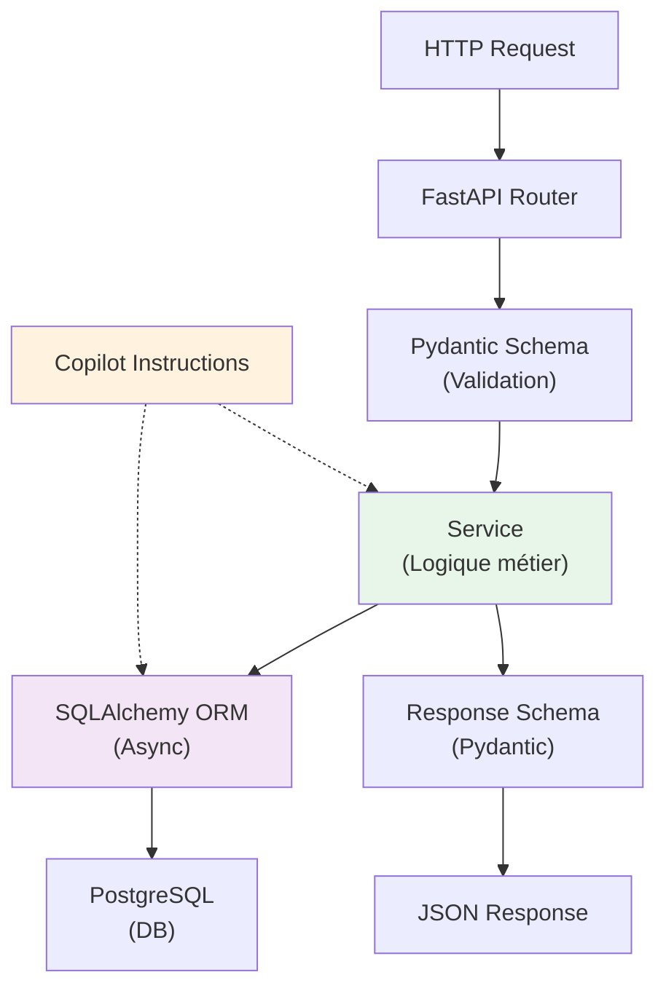

# :simple-python: Cas d'Usage — Python & FastAPI avec GitHub Copilot

<span class="badge-intermediate">Intermédiaire</span>

## Stack Recommandé

Configuration optimale pour Copilot sur Python/FastAPI :

| Composant | Version | Raison |
|-----------|---------|--------|
| **Python** | 3.11+ LTS | Type hints améliorés, performance |
| **Framework** | FastAPI 0.100+ | Async natif, Pydantic v2 auto-docs |
| **ORM** | SQLAlchemy 2.0+ | Type hints complètes, async support |
| **Validation** | Pydantic 2.0+ | Type inference impeccable |
| **Testing** | pytest 7.4+ | Fixtures, parametrize, coverage |
| **Type Checker** | mypy 1.5+ ou Pyright | Détecte erreurs avant runtime |
| **Linter** | Ruff 0.1+ | Ultra-rapide, très complet |
| **IDE** | VS Code + Pylance | Meilleur support Python + Copilot |

---

## Configurer Copilot pour FastAPI

### Custom Instructions (`.github/copilot-instructions.md`)

```markdown
# GitHub Copilot — Python/FastAPI Project

Stack: Python 3.11, FastAPI 0.100, SQLAlchemy 2.0, Pydantic 2.0, PostgreSQL 15

Architecture (Layered):
- Routes: FastAPI APIRouter — max 10 lines per endpoint
- Schemas: Pydantic models for validation + response serialization
- Models: SQLAlchemy ORM entities with type annotations
- Services: Business logic, database operations, external integrations
- Dependencies: FastAPI dependency injection for auth + DB session
- Tests: pytest with fixtures, parametrize, mock where needed

Conventions:
- Naming: snake_case functions, PascalCase classes/models
- Type hints: ALL functions must have return type annotation
- Docstrings: Google-style docstrings for all public functions
- Async: Use async/await for I/O operations (DB, API calls)
- Error handling: Raise FastAPI HTTPException for API errors

Pydantic:
- BaseModel for all request/response schemas
- Use Field() for documentation + validation
- Config class for orm_mode = True (SQLAlchemy interop)
- Use validators for custom validation logic

FastAPI:
- router.get/post/put/delete for endpoints
- Dependency injection for auth, DB session
- HTTPException for error responses with status codes
- Tags for grouping endpoints in docs

Testing:
- Use pytest fixtures for DB session, app client
- Test all happy paths + error cases
- Mock external services (APIs, payment gateways)
- Coverage target: 80% minimum

Database:
- Async engine: create_async_engine()
- Sessions via dependency injection
- Migrations: Alembic with auto-detect
- Relationships: Use back_populates for bidirectional relations

Security:
- OAuth2 via oauth2_scheme or custom middleware
- Password hashing: passlib with bcrypt
- JWTs for stateless auth
- Rate limiting: via slowapi or custom middleware

Type Safety:
- Enable strict mypy checks
- No implicit Any
- Use Literal[] for string enums
- Use Union[] / Optional[] explicitly
```

---

## Patterns FastAPI Optimisés pour Copilot

### 1. Route avec Pydantic Validation

```python
# schemas/user.py
from pydantic import BaseModel, EmailStr, Field

class UserCreate(BaseModel):
    email: EmailStr
    name: str = Field(..., min_length=2, max_length=100)
    age: int = Field(..., ge=18, le=150)

class UserResponse(BaseModel):
    id: int
    email: str
    name: str
    model_config = {"from_attributes": True}  # SQLAlchemy interop

# routes/users.py
from fastapi import APIRouter, Depends, HTTPException, status
from sqlalchemy.ext.asyncio import AsyncSession
from ..schemas.user import UserCreate, UserResponse
from ..services.user import UserService
from ..dependencies import get_db_session

router = APIRouter(prefix="/users", tags=["users"])
user_service = UserService()

@router.post("", response_model=UserResponse, status_code=status.HTTP_201_CREATED)
async def create_user(
    user_create: UserCreate,
    db: AsyncSession = Depends(get_db_session)
) -> UserResponse:
    """Crée un nouvel utilisateur avec validation d'unicité d'email."""
    existing = await user_service.get_by_email(db, user_create.email)
    if existing:
        raise HTTPException(
            status_code=status.HTTP_400_BAD_REQUEST,
            detail="Email already registered"
        )
    
    user = await user_service.create(db, user_create)
    return UserResponse.model_validate(user)

@router.get("/{user_id}", response_model=UserResponse)
async def get_user(
    user_id: int,
    db: AsyncSession = Depends(get_db_session)
) -> UserResponse:
    """Récupère un utilisateur par ID."""
    user = await user_service.get_by_id(db, user_id)
    if not user:
        raise HTTPException(
            status_code=status.HTTP_404_NOT_FOUND,
            detail="User not found"
        )
    return UserResponse.model_validate(user)
```

### 2. Service avec SQLAlchemy Async

```python
# services/user.py
from sqlalchemy import select
from sqlalchemy.ext.asyncio import AsyncSession
from ..models.user import User
from ..schemas.user import UserCreate

class UserService:
    async def create(self, db: AsyncSession, user_create: UserCreate) -> User:
        """Crée et persiste un nouvel utilisateur."""
        db_user = User(
            email=user_create.email,
            name=user_create.name,
            age=user_create.age
        )
        db.add(db_user)
        await db.commit()
        await db.refresh(db_user)
        return db_user
    
    async def get_by_id(self, db: AsyncSession, user_id: int) -> User | None:
        """Récupère un utilisateur par ID."""
        stmt = select(User).where(User.id == user_id)
        result = await db.execute(stmt)
        return result.scalar_one_or_none()
    
    async def get_by_email(self, db: AsyncSession, email: str) -> User | None:
        """Récupère un utilisateur par email."""
        stmt = select(User).where(User.email == email)
        result = await db.execute(stmt)
        return result.scalar_one_or_none()
```

### 3. SQLAlchemy Models Typés

```python
# models/user.py
from datetime import datetime
from sqlalchemy import String, Integer, DateTime, func
from sqlalchemy.orm import declarative_base, Mapped, mapped_column

Base = declarative_base()

class User(Base):
    __tablename__ = "users"
    
    id: Mapped[int] = mapped_column(primary_key=True)
    email: Mapped[str] = mapped_column(String(255), unique=True, nullable=False)
    name: Mapped[str] = mapped_column(String(100), nullable=False)
    age: Mapped[int] = mapped_column(Integer, nullable=False)
    created_at: Mapped[datetime] = mapped_column(
        DateTime(timezone=True),
        server_default=func.now(),
        nullable=False
    )
    updated_at: Mapped[datetime] = mapped_column(
        DateTime(timezone=True),
        server_default=func.now(),
        onupdate=func.now(),
        nullable=False
    )
```

---

## Tests Pytest + Copilot

### Prompt Chat Efficace

```
@monprojet Génère tests complets avec pytest pour la fonction create_user

Utilise :
- AsyncClient pour tester l'endpoint POST /users
- Fixture pour session DB + app FastAPI
- Cas happy path + email déjà existant
- Mock optionnellement UserService si nécessaire

Structure : test_routes/test_users.py
```

**Copilot génère** :

```python
# tests/test_routes/test_users.py
import pytest
from httpx import AsyncClient
from sqlalchemy.ext.asyncio import AsyncSession, create_async_engine, async_sessionmaker

from app.main import app
from app.models.user import Base, User
from app.schemas.user import UserCreate

@pytest.fixture
async def db_session():
    """Fixture DB session de test."""
    engine = create_async_engine("sqlite+aiosqlite:///:memory:")
    async with engine.begin() as conn:
        await conn.run_sync(Base.metadata.create_all)
    
    async_session = async_sessionmaker(engine, class_=AsyncSession)
    async with async_session() as session:
        yield session

@pytest.fixture
async def client(db_session):
    """Fixture client HTTP test."""
    def override_get_db():
        return db_session
    
    app.dependency_overrides[get_db_session] = override_get_db
    async with AsyncClient(app=app, base_url="http://test") as ac:
        yield ac
    app.dependency_overrides.clear()

@pytest.mark.asyncio
async def test_create_user_success(client: AsyncClient):
    """Test création utilisateur succès."""
    response = await client.post(
        "/users",
        json={"email": "john@example.com", "name": "John", "age": 25}
    )
    assert response.status_code == 201
    data = response.json()
    assert data["email"] == "john@example.com"

@pytest.mark.asyncio
async def test_create_user_email_exists(client: AsyncClient, db_session: AsyncSession):
    """Test création avec email déjà existant."""
    # Créer user existant
    existing_user = User(email="existing@example.com", name="Existing", age=30)
    db_session.add(existing_user)
    await db_session.commit()
    
    # Tentative doublé
    response = await client.post(
        "/users",
        json={"email": "existing@example.com", "name": "Another", "age": 25}
    )
    assert response.status_code == 400
    assert "already registered" in response.json()["detail"]
```

---

## Pièges Courants Python/FastAPI

| Piège | Signe | Solution |
|-------|-------|----------|
| **Pas de type hints** | Suggestions Copilot génériques | Ajouter annotations partout |
| **Oublier await** | Coroutine non exécutée (Warning) | Toujours `await` pour async |
| **Session DB pas fermée** | Fuites mémoire en production | Utiliser dépendances FastAPI |
| **Pydantic v1 vs v2** | Incompatibilités `Config` | Utiliser v2 uniquement (2024) |
| **N+1 queries SQLAlchemy** | Requêtes exponentielles | Utiliser `selectinload()` pour relations |
| **Mutation de modèle** | Changements non persistés | Toujours `commit()` après modification |

---

## Diagramme : FastAPI + Copilot



---

## Ressources

- [Best Practices](../chapitre-4-bonnes-pratiques/utilisation-effective.md)
- [Comparaison Écosystèmes](comparaison-ecosystemes.md)
- [Configuration VS Code](../chapitre-2-parametrage/vscode-parametrage.md)
│       │   └── dependencies.py
│       ├── services/
│       └── repositories/
├── tests/
│   ├── conftest.py
│   ├── unit/
│   └── integration/
├── pyproject.toml
└── mypy.ini
```

---

## Configuration Copilot pour Python

### `.github/copilot-instructions.md`

```markdown
---
applyTo: '**/*.py'
---

# Conventions Python du projet

## Versions et outils
- Python 3.11+
- Framework: FastAPI avec Pydantic v2
- ORM: SQLAlchemy 2.0 (style déclaratif avec Mapped[])
- Tests: pytest avec fixtures de scope function par défaut
- Linting: Ruff, formatting: Black, type checking: mypy strict

## Conventions de code
- Annotations de type obligatoires sur toutes les fonctions publiques
- Pydantic: utiliser `model_validator` et `field_validator` de Pydantic v2 (pas v1)
- SQLAlchemy: utiliser `Mapped[type]` et `mapped_column()` (style 2.0)
- Async: toutes les routes FastAPI sont async
- Erreurs: lever des exceptions HTTP avec `raise HTTPException(status_code=..., detail=...)`

## Patterns interdits
- Pas d'import `*`
- Pas de variables `data`, `result`, `obj` sans contexte de type
- Pas de `except Exception` sans re-raise ou logging
```

### `.github/instructions/fastapi-routes.instructions.md`

```markdown
---
applyTo: 'src/**/api/routes/*.py'
---

## Pattern des routes FastAPI

- Chaque route utilise un service injecté via Depends()
- Retourner toujours un schéma Pydantic, jamais un modèle SQLAlchemy
- Status codes explicites: 201 pour création, 204 pour suppression
- Tags fournis pour la documentation OpenAPI automatique

## Template de route

```python
@router.post(
    "/",
    response_model=UserResponse,
    status_code=status.HTTP_201_CREATED,
    summary="Créer un nouvel utilisateur",
    tags=["users"],
)
async def create_user(
    user_data: CreateUserRequest,
    service: UserService = Depends(get_user_service),
) -> UserResponse:
    return await service.create(user_data)
```
```

---

## Cas d'usage pratiques

### 1. Modèle SQLAlchemy 2.0

```python
# Modèle User avec SQLAlchemy 2.0
# Relations: un User a plusieurs Orders
# Champs: id, email (unique), username, created_at, is_active
from sqlalchemy.orm import Mapped, mapped_column, relationship

class User(Base):
    __tablename__ = "users"
    # Copilot génère les champs avec les bons types Mapped[]
```

### 2. Schéma Pydantic v2

```python
# Schéma de validation pour la création d'un utilisateur
# email: format email, validé
# password: min 8 chars, au moins 1 majuscule, 1 chiffre
# username: 3-50 chars, alnum + underscores
from pydantic import BaseModel, EmailStr, field_validator

class CreateUserRequest(BaseModel):
    # Copilot génère les champs et les validators
```

### 3. Service avec injection de dépendances

```python
# Service de gestion des utilisateurs
# Dépend du UserRepository (injecté)
# Méthodes: create, get_by_id, get_by_email, update, delete
class UserService:
    def __init__(self, repository: UserRepository) -> None:
        self.repository = repository
    
    async def create(self, data: CreateUserRequest) -> UserResponse:
        # Copilot complète la logique avec hash du mot de passe, vérification unicitié
```

### 4. Tests pytest avec fixtures

Dans Copilot Chat :
```
Génère les tests pytest pour UserService.create().
Utilise des fixtures:
- mock_repository: mocke UserRepository avec pytest-mock
- Couvre: création réussie, email déjà utilisé (UserAlreadyExistsError), 
  email invalide, et mot de passe trop faible
Utilise pytest.mark.asyncio pour les tests async.
```

---

## Configuration `pyproject.toml` orientée qualité

```toml
[tool.mypy]
python_version = "3.11"
strict = true
warn_return_any = true
warn_unused_configs = true

[tool.ruff]
select = ["E", "F", "I", "UP", "ANN"]  # ANN = vérification annotations de type
ignore = ["ANN101"]  # self n'a pas besoin d'annotation

[tool.pytest.ini_options]
asyncio_mode = "auto"
testpaths = ["tests"]
```

---

## Configuration IDE

=== ":material-microsoft-visual-studio-code: VS Code"
    ```json
    // .vscode/settings.json
    {
        "python.defaultInterpreterPath": "${workspaceFolder}/.venv/bin/python",
        "python.analysis.typeCheckingMode": "strict",
        "python.analysis.autoImportCompletions": true,
        "editor.formatOnSave": true,
        "[python]": {
            "editor.defaultFormatter": "ms-python.black-formatter",
            "editor.codeActionsOnSave": {
                "source.organizeImports": "explicit"
            }
        },
        "github.copilot.enable": {
            "python": true
        }
    }
    ```
    
    Extensions recommandées :
    - `ms-python.python` — Python Language Server
    - `ms-python.pylance` — Pylance (type checking)
    - `ms-python.black-formatter` — Black formatter
    - `charliermarsh.ruff` — Ruff linter

=== "PyCharm"
    - **Settings → Python Interpreter** : configurez le venv
    - **Settings → Editor → Inspections → Python** : activez les warnings de type
    - Plugin GitHub Copilot : utilise le type inference de PyCharm pour enrichir le contexte
    - Le support des annotations de type est aussi bon qu'avec Pylance

---

## Utiliser Copilot pour les migrations de base de données

```python
# Migration Alembic pour ajouter la table 'products' 
# Champs: id (UUID), name (VARCHAR 255), price (DECIMAL 10,2), 
#         category_id (FK vers categories), created_at (TIMESTAMP DEFAULT NOW())
def upgrade() -> None:
    # Copilot génère le op.create_table() complet
```

---

## Prochaines étapes

- [Java — Cas d'Usage](java.md)
- [Node.js & React — Cas d'Usage](nodejs-react.md)
