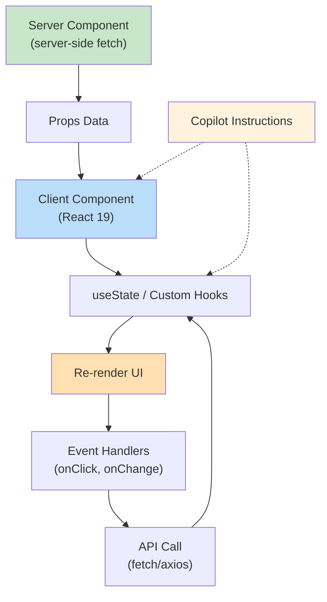

# :simple-react: Cas d'Usage — React 19 & TypeScript avec GitHub Copilot

<span class="badge-intermediate">Intermédiaire</span>

## Stack Recommandé

Configuration pour maximaliser Copilot sur React :

| Composant | Version | Raison |
|-----------|---------|--------|
| **React** | 19.x | Compiler, Server Components, use hook |
| **Framework** | Next.js 15+ ou Vite 6+ | Build tooling moderne, HMR rapide |
| **Language** | TypeScript 5.x stricte | Type inference impeccable |
| **State** | Zustand ou TanStack Query | Minimaliste, Copilot-friendly |
| **Styling** | Tailwind CSS | Utility-first, intellisense complète |
| **Testing** | Vitest + React Testing Library | RTL patterns stables |
| **Components** | Shadcn/ui ou Headless UI | Headless, composables |

---

## Configurer Copilot pour React

### Custom Instructions (`.github/copilot-instructions.md`)

```markdown
# GitHub Copilot — React 19 + TypeScript Project

Stack: React 19, Next.js 15 (or Vite), TypeScript 5, Tailwind CSS, Zustand

Component Architecture:
- Functional components ONLY (no class components)
- Props: Always type interface IProps { ... } or type Props = { ... }
- Hooks: Use custom hooks for logic extraction (useEffect, useCallback, useMemo)
- Naming: PascalCase for components, camelCase for hooks
- File structure: component.tsx + component.test.tsx + types.ts (if complex)

Hooks best practices:
- Extract logic to custom hooks (useUser, useFetch, useForm, etc.)
- Dependencies array ALWAYS specified (ESLint rule)
- No infinite loops (useCallback + useMemo to break cycles)
- Use React 19 hooks: use() for server component data, useTransition() for async UI

State management (Zustand):
- Define stores in stores/ folder
- Use Zustand hooks for global state
- Local state with useState for component-specific data
- Never lift state unnecessarily

Server Components (Next.js):
- async components for data fetching
- Pass data to Client Components via props
- Mark with "use server" for server actions

Forms & Validation:
- Use react-hook-form + Zod for validation
- Zod schema as single source of truth
- Error display: via form.formState.errors

Styling:
- Tailwind CSS classes — no inline styles
- Responsive: sm:, md:, lg: prefixes
- Dark mode: dark: prefix where needed
- Custom colors: Define in tailwind.config.ts

Accessibility:
- aria-label for icons + buttons without text
- semantic HTML: <button>, <form>, <header>, <nav>, <main>, <footer>
- Focus management: tabIndex, autoFocus where needed
- Keyboard navigation: onKeyDown for custom interactions

Testing:
- RTL: render component + screen.getByRole/getByLabelText
- Usernames events: fireEvent.click(), userEvent.type()
- Accessibility assertions: toBeInTheDocument(), toBeVisible()
- Mocking: vi.mock() for modules, mock API calls

Performance:
- Code splitting: dynamic imports with React.lazy()
- Image optimization: next/image or Image component
- Bundle analysis: use next/package-json analyze
```

### Activation VS Code

1. Créez `.github/copilot-instructions.md` à la racine du projet
2. Ouvrez composants React dans VS Code
3. Copilot respecte patterns TypeScript + Tailwind

---

## Patterns React Optimisés pour Copilot

### 1. Typed Functional Component

```typescript
// components/UserCard.tsx
import React from 'react';

interface UserCardProps {
  userId: string;
  onDelete?: (id: string) => void;
}

export const UserCard: React.FC<UserCardProps> = ({ userId, onDelete }) => {
  const [isLoading, setIsLoading] = React.useState(false);
  
  const handleDelete = async () => {
    setIsLoading(true);
    try {
      await fetch(`/api/users/${userId}`, { method: 'DELETE' });
      onDelete?.(userId);
    } catch (error) {
      console.error('Delete failed:', error);
    } finally {
      setIsLoading(false);
    }
  };
  
  return (
    <div className="p-4 border rounded-lg">
      <h3 className="font-bold">{userId}</h3>
      <button
        onClick={handleDelete}
        disabled={isLoading}
        className="mt-2 px-4 py-2 bg-red-500 text-white rounded hover:bg-red-600 disabled:opacity-50"
        aria-label={`Delete user ${userId}`}
      >
        {isLoading ? 'Deleting...' : 'Delete'}
      </button>
    </div>
  );
};
```

**Prompt Copilot** : "Génère un composant React qui affiche une liste d'utilisateurs avec pagination et suppression"
→ Copilot comprend l'interface IProps, types React.FC, Tailwind classes

### 2. Custom Hook Pattern

```typescript
// hooks/useUser.ts
import { useEffect, useState, useCallback } from 'react';

interface User {
  id: string;
  email: string;
  name: string;
}

export const useUser = (userId: string) => {
  const [user, setUser] = useState<User | null>(null);
  const [loading, setLoading] = useState(true);
  const [error, setError] = useState<Error | null>(null);
  
  const fetchUser = useCallback(async () => {
    try {
      setLoading(true);
      const res = await fetch(`/api/users/${userId}`);
      if (!res.ok) throw new Error('Failed to fetch user');
      setUser(await res.json());
    } catch (err) {
      setError(err instanceof Error ? err : new Error('Unknown error'));
    } finally {
      setLoading(false);
    }
  }, [userId]); // Dépendance userId
  
  useEffect(() => {
    fetchUser();
  }, [fetchUser]); // fetchUser change quand userId change
  
  return { user, loading, error, refetch: fetchUser };
};

// Usage in component
export const UserProfile = ({ userId }: { userId: string }) => {
  const { user, loading, error } = useUser(userId);
  
  if (loading) return <div>Loading...</div>;
  if (error) return <div>Error: {error.message}</div>;
  
  return <div>{user?.name}</div>;
};
```

### 3. Server Component (Next.js) + Client Component

```typescript
// app/dashboard/page.tsx (Server Component)
import { getUserList } from '@/lib/api';
import UserList from '@/components/UserList';

export default async function DashboardPage() {
  const users = await getUserList(); // Server-side data fetch
  
  return (
    <main>
      <h1>Dashboard</h1>
      {/* Passer data au client component */}
      <UserList initialUsers={users} />
    </main>
  );
}
```

```typescript
// components/UserList.tsx (Client Component)
'use client';

import React, { useState } from 'react';

interface UserListProps {
  initialUsers: Array<{ id: string; name: string }>;
}

export default function UserList({ initialUsers }: UserListProps) {
  const [users, setUsers] = useState(initialUsers);
  
  const handleDelete = async (userId: string) => {
    await fetch(`/api/users/${userId}`, { method: 'DELETE' });
    setUsers(prev => prev.filter(u => u.id !== userId));
  };
  
  return (
    <ul>
      {users.map(user => (
        <li key={user.id} className="flex justify-between p-2 border-b">
          <span>{user.name}</span>
          <button onClick={() => handleDelete(user.id)} className="text-red-500">
            Delete
          </button>
        </li>
      ))}
    </ul>
  );
}
```

### 4. Form avec React Hook Form + Zod

```typescript
// components/CreateUserForm.tsx
'use client';

import React from 'react';
import { useForm } from 'react-hook-form';
import { zodResolver } from '@hookform/resolvers/zod';
import { z } from 'zod';

const createUserSchema = z.object({
  email: z.string().email('Invalid email'),
  name: z.string().min(2, 'Name must be at least 2 chars'),
});

type CreateUserFormData = z.infer<typeof createUserSchema>;

export const CreateUserForm = () => {
  const { register, handleSubmit, formState: { errors } } = useForm<CreateUserFormData>({
    resolver: zodResolver(createUserSchema),
  });
  
  const onSubmit = async (data: CreateUserFormData) => {
    const res = await fetch('/api/users', {
      method: 'POST',
      headers: { 'Content-Type': 'application/json' },
      body: JSON.stringify(data),
    });
    
    if (res.ok) {
      alert('User created');
    }
  };
  
  return (
    <form onSubmit={handleSubmit(onSubmit)} className="space-y-4">
      <div>
        <input
          {...register('email')}
          type="email"
          placeholder="Email"
          className="w-full px-4 py-2 border rounded"
        />
        {errors.email && <span className="text-red-500">{errors.email.message}</span>}
      </div>
      
      <div>
        <input
          {...register('name')}
          placeholder="Name"
          className="w-full px-4 py-2 border rounded"
        />
        {errors.name && <span className="text-red-500">{errors.name.message}</span>}
      </div>
      
      <button type="submit" className="px-4 py-2 bg-blue-500 text-white rounded">
        Create
      </button>
    </form>
  );
};
```

---

## Tests React Testing Library

### Prompt Copilot complet

```
Génère test unitaire complet avec Vitest + React Testing Library

component: UserCard (reçoit userId + onDelete callback)
Test cases:
  1. Affiche userId passé en props
  2. Appelle onDelete quand bouton Delete cliqué
  3. Affiche "Deleting..." pendant la requête API

Mock fetch API
```

**Copilot génère** :

```typescript
// components/UserCard.test.tsx
import { describe, it, expect, vi } from 'vitest';
import { render, screen, fireEvent, waitFor } from '@testing-library/react';
import { UserCard } from './UserCard';

describe('UserCard', () => {
  it('should display userId', () => {
    render(<UserCard userId="123" />);
    expect(screen.getByText('123')).toBeInTheDocument();
  });
  
  it('should call onDelete when delete button clicked', async () => {
    const mockOnDelete = vi.fn();
    global.fetch = vi.fn(() => Promise.resolve(new Response()));
    
    render(<UserCard userId="123" onDelete={mockOnDelete} />);
    fireEvent.click(screen.getByRole('button', { name: /delete/i }));
    
    await waitFor(() => {
      expect(mockOnDelete).toHaveBeenCalledWith('123');
    });
  });
  
  it('should show loading state while deleting', async () => {
    render(<UserCard userId="123" />);
    fireEvent.click(screen.getByRole('button', { name: /delete/i }));
    
    expect(screen.getByText('Deleting...')).toBeInTheDocument();
  });
});
```

---

## Diagramme : React Data Flow



---

## Pièges Courants React

| Piège | Signe | Solution |
|-------|-------|----------|
| **Infinite loop** | Component re-rend infiniment | Vérifier `useEffect` dependencies |
| **Stale closure** | Variable cassée dans callback | Utiliser `useCallback` + deps array |
| **Missing key on list** | React warning, items switch | Toujours key= unique identifier |
| **Forgetting await** | State pas mis à jour | Utiliser `async` + `await` |
| **Mutations** | Copilot suggestions faibles | Jamais muter state — construire nouveau object |
| **Type any** | Autocomplétion désactivée | Toujours typer Props + retours |

---

## Ressources

- [Best Practices](../chapitre-4-bonnes-pratiques/utilisation-effective.md)
- [Comparaison Ecosystèmes](comparaison-ecosystemes.md)
- [Configuration VS Code](../chapitre-2-parametrage/vscode-parametrage.md)